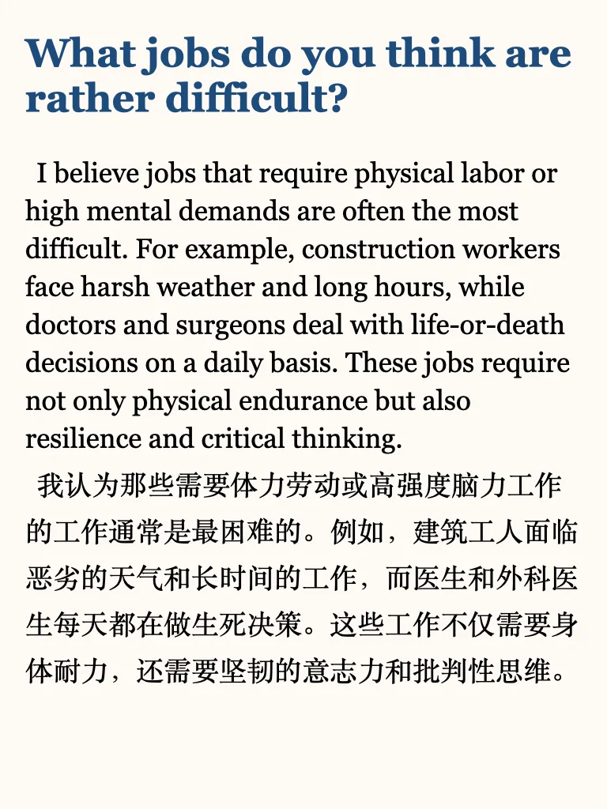
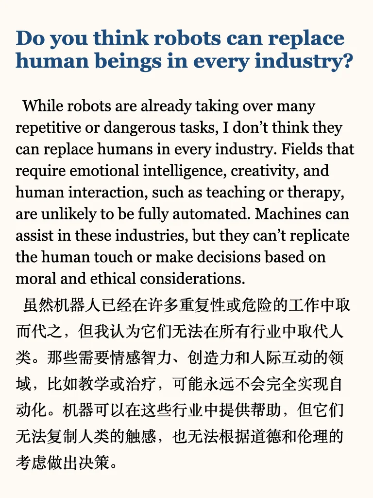
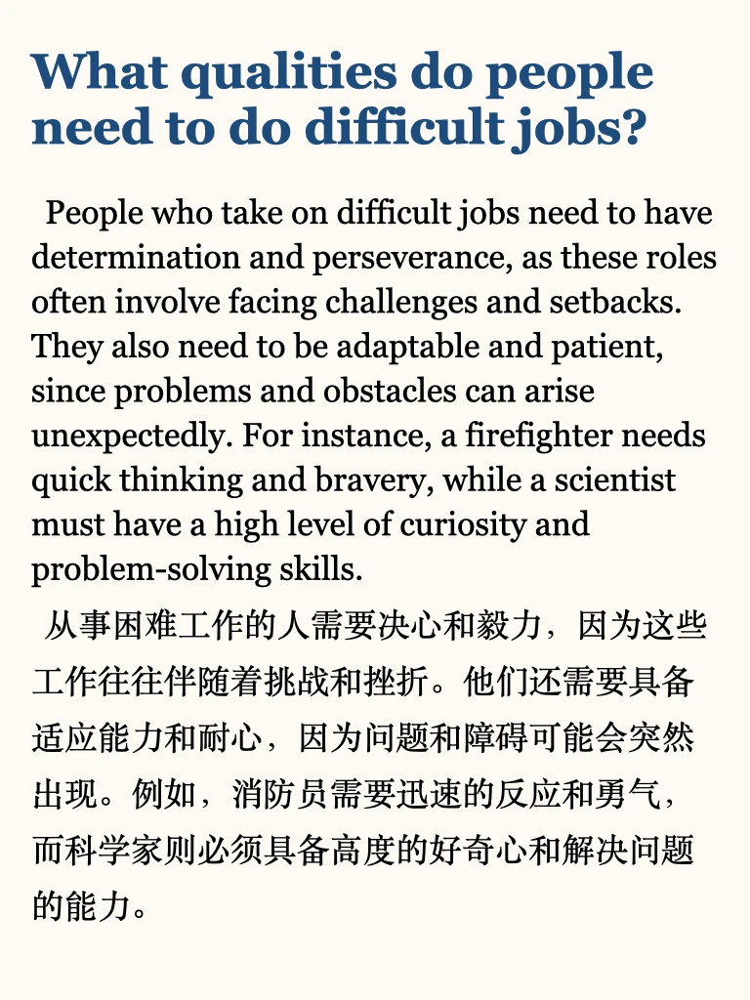
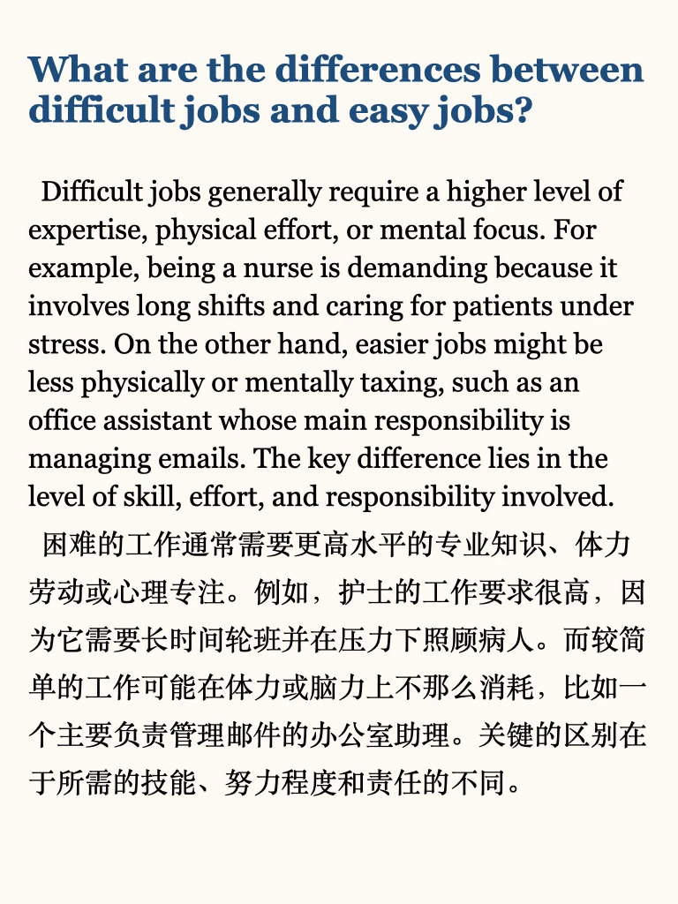
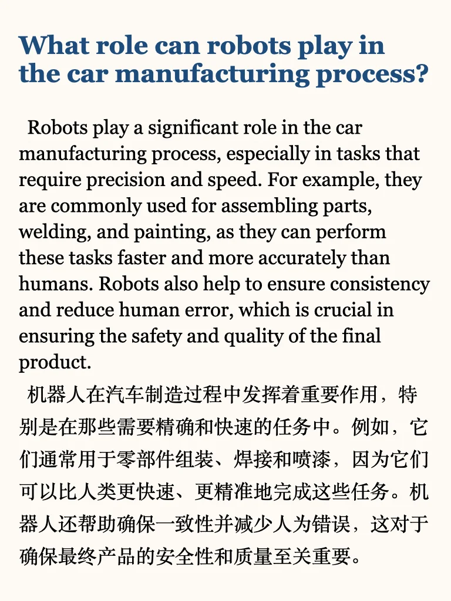
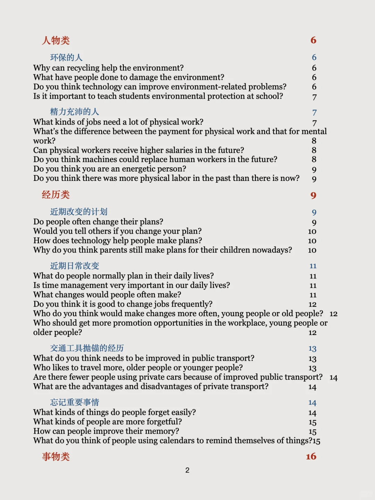
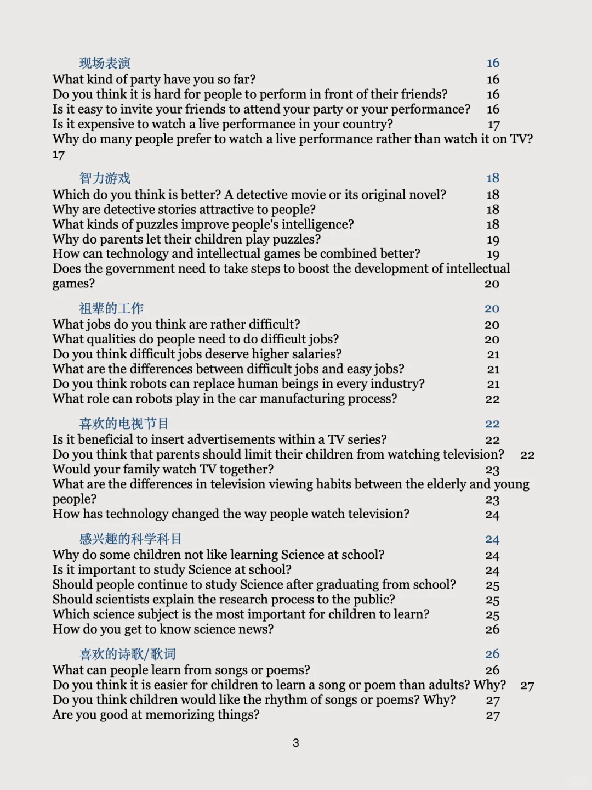
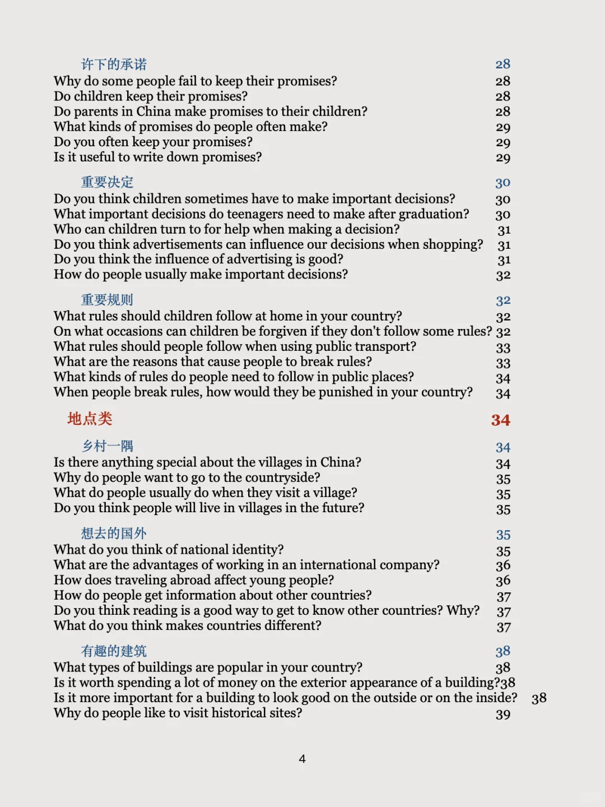

# 雅思新题part3｜祖辈工作

左下角get 上季度完整part3题目 ➕ 本季度更新
目前已更新：
环保的人
精力充沛的人
近期改变的计划
近期日常改变
交通工具抛锚的经历
忘记重要事情
现场表演
智力游戏
祖辈的工作
喜欢的电视节目
感兴趣的科学科目
喜欢的诗歌/歌词
许下的承诺
重要决定
重要规则
乡村一隅
想去的国外
有趣的建筑
详细目录在8-10页
	
短期备考的同学，推荐学习我的就急包，6天冲级高分💪
更多英语干货在最后一页

## 图片
| 图1 | 图2 | 图3 | 图4 |
| --- | --- | --- | --- |
|  |  |  |  |
|  |  |  |  |
|  |  |  |   |

生成时间：2025-11-14 19:32:14