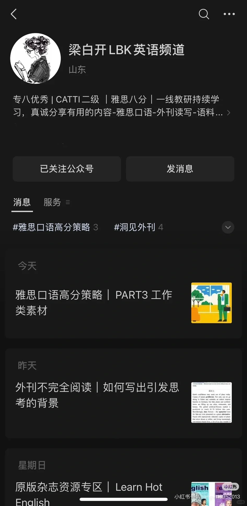
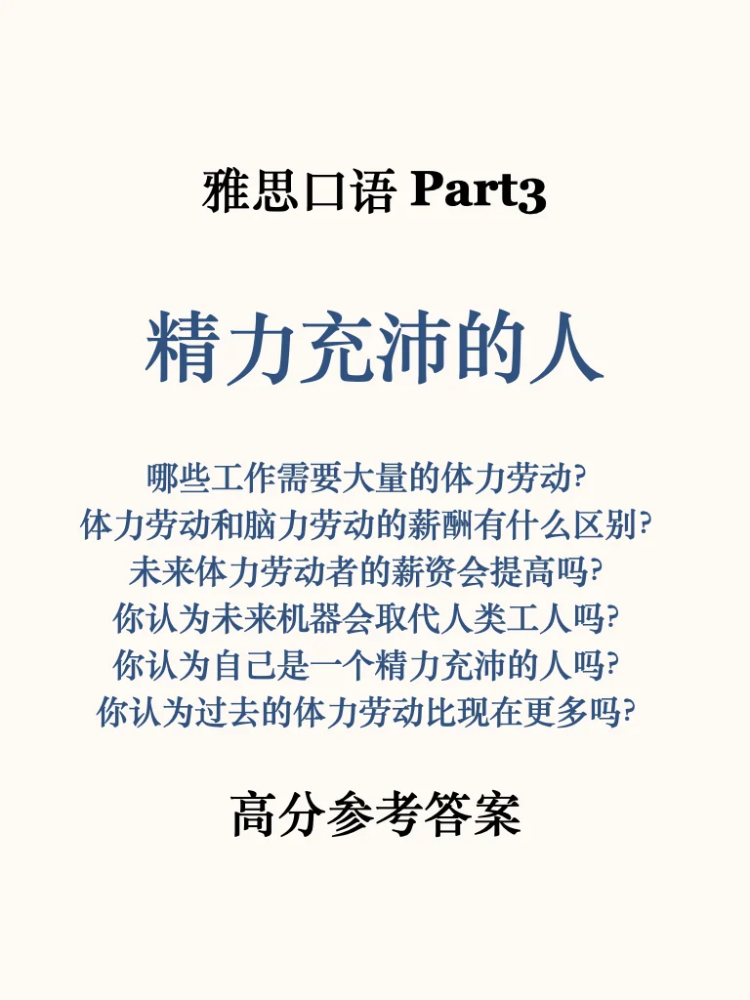
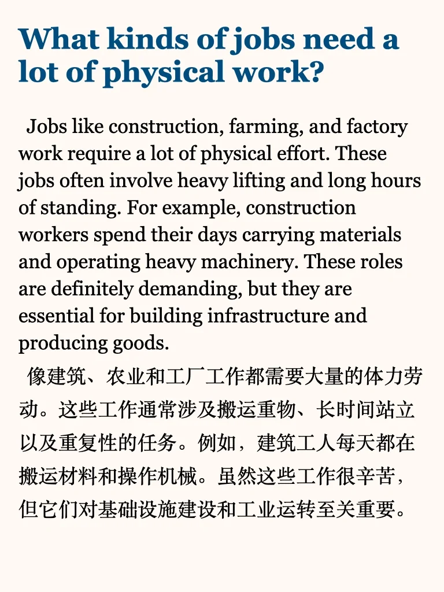
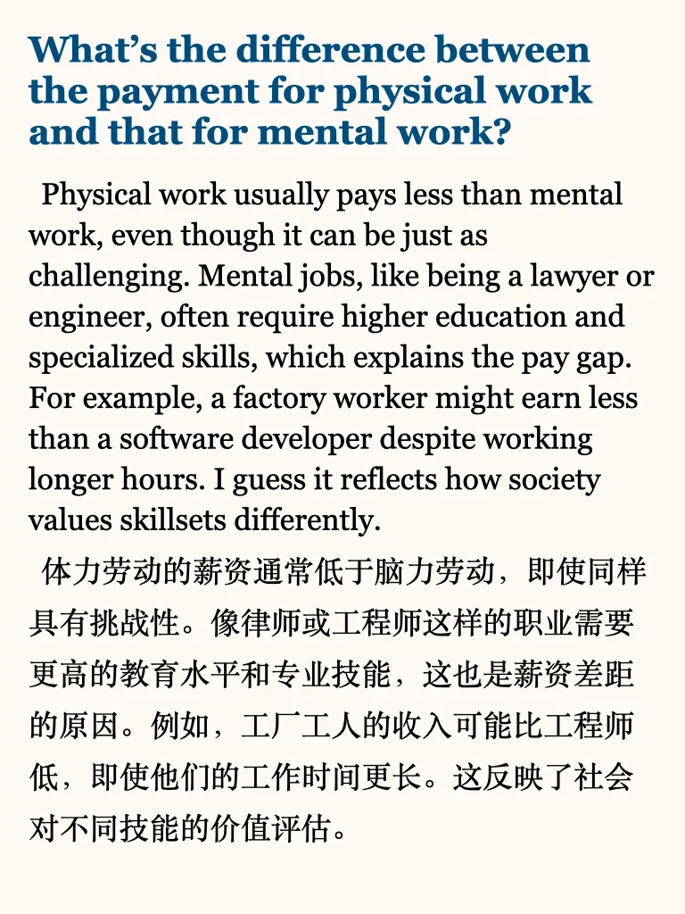
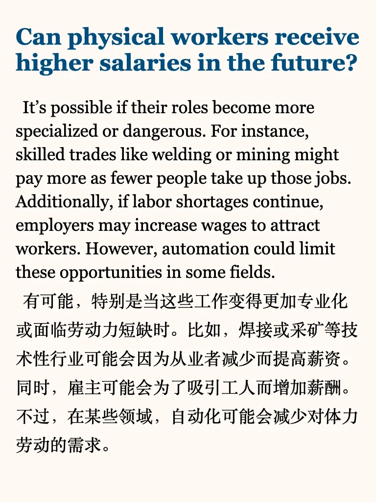
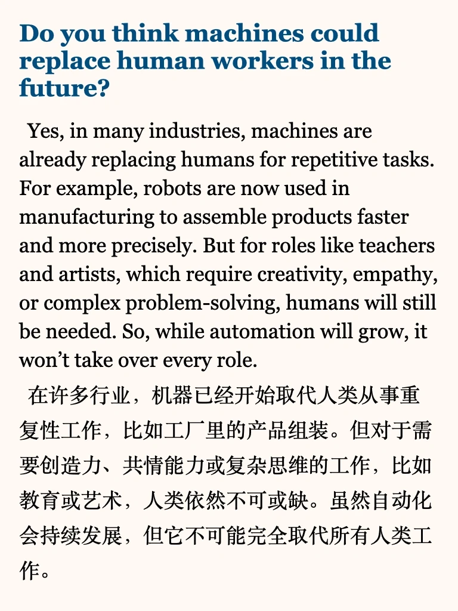
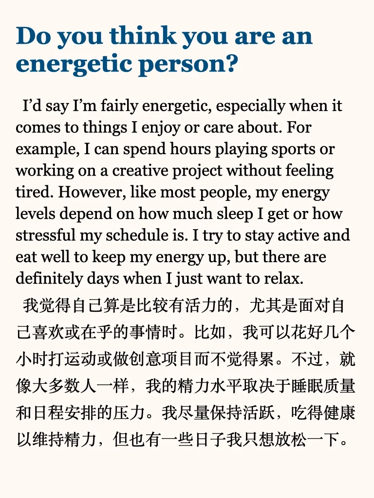
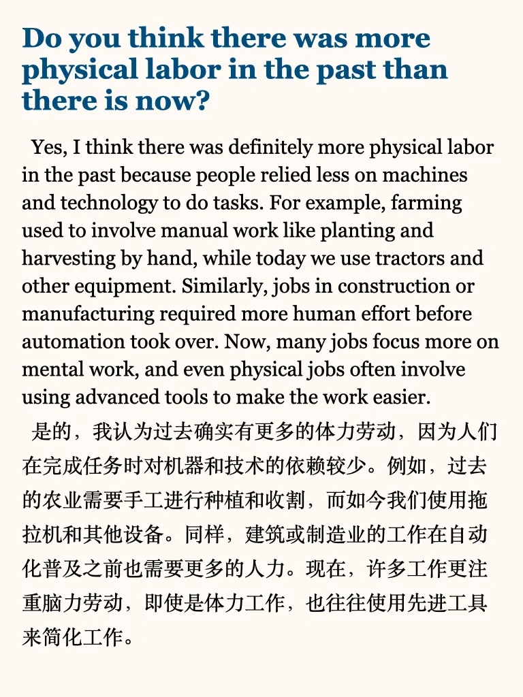

# 雅思口语新题高分素材 速速收藏！

左下角get 上季度完整part3题目 ➕ 本季度更新
目前已更新：
环保的人 精力充沛的人
近期改变的计划 近期日常改变
交通工具抛锚的经历 忘记重要事情 现场表演
智力游戏 祖辈的工作 喜欢的电视节目
感兴趣的科学科目 喜欢的诗歌/歌词
许下的承诺 重要决定 重要规则 乡村一隅
想去的国外 有趣的建筑
短期备考的同学，推荐学习我的就急包，6天冲级高分💪
	
更多英语干货在最后一页 
#英语地道表达 #雅思口语 #雅思口语part3 #雅思口语高分答案 #雅思口语新题 #雅思口语换题 #口语

## 图片
| 图1 | 图2 | 图3 | 图4 |
| --- | --- | --- | --- |
|  |  |  |  |
|  |  |  |  |

生成时间：2025-11-14 19:27:39