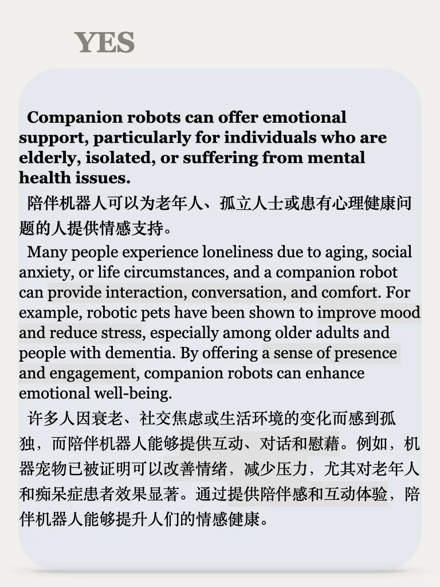
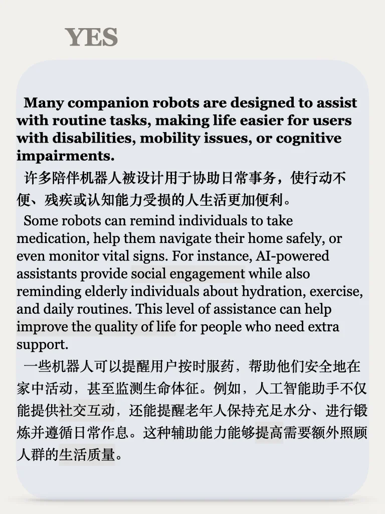
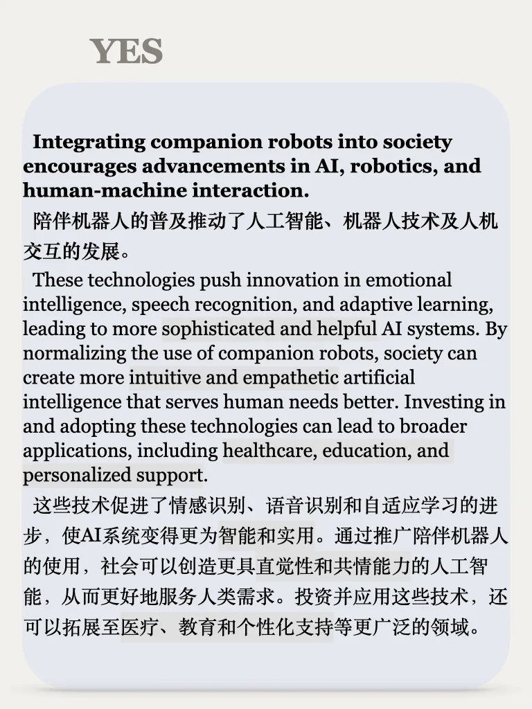
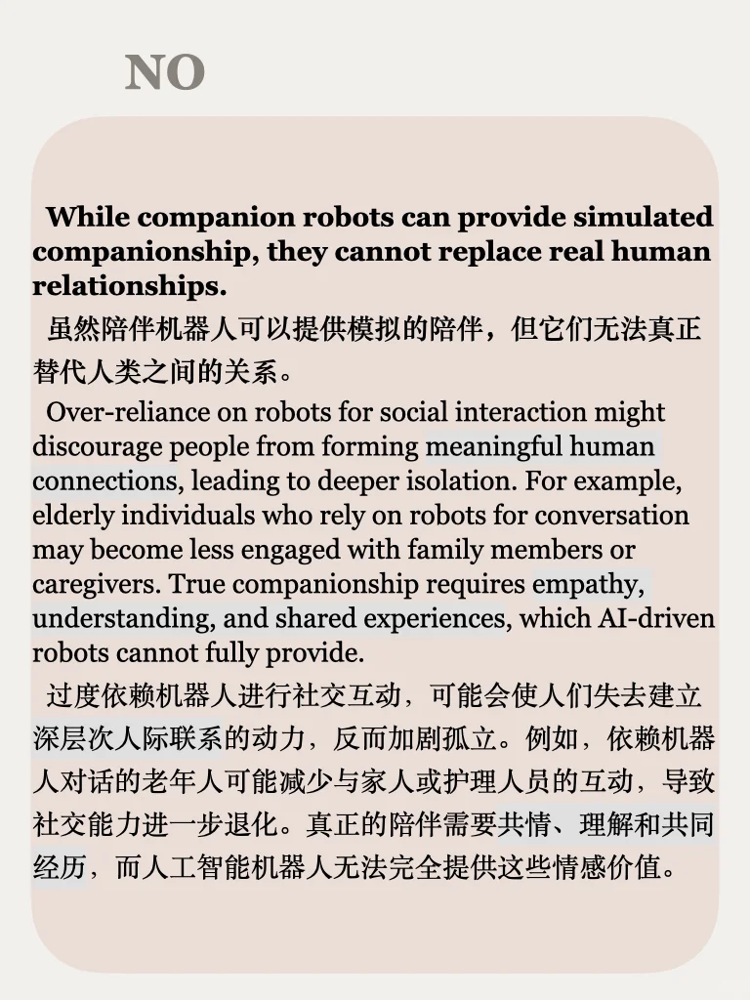
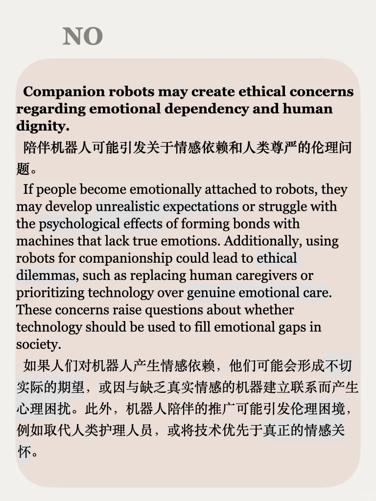

# 思辨系列65期｜陪伴型机器人

【每周一更】思辨系列，培养辩证逻辑
社会、个人发展、媒体、科技、自然……每周一个热点话题，从正反两面深度剖析，帮你积累写作素材、提升口语观点～
📖目前更新至65期，持续更新，左下角获取完整内容，助你在备考中脱颖而出！
🚀快来一起培养思辨能力，成为逻辑达人！
	
更多干货 在最后一页🌹
#英语地道表达 #雅思备考 #科技与人文 #智能机器人 #雅思 #辩论 #观点 #写作素材 #四六级 #考研英语

## 图片
| 图1 | 图2 | 图3 | 图4 |
| --- | --- | --- | --- |
|  |  |  |  |
|  |  |  |  |

生成时间：2025-11-14 19:25:26