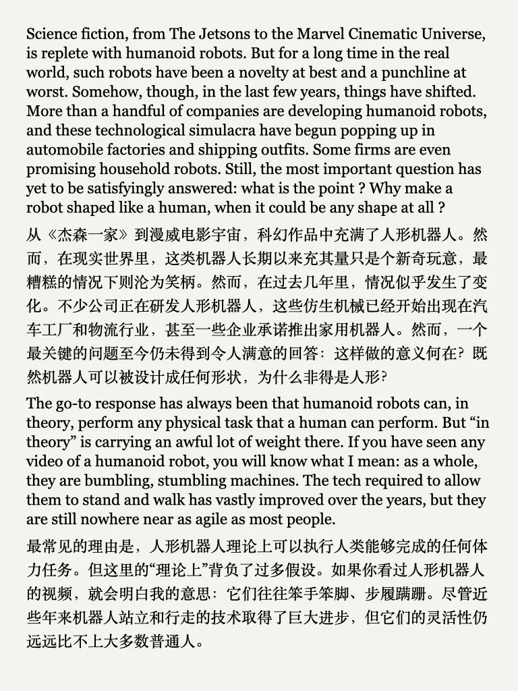
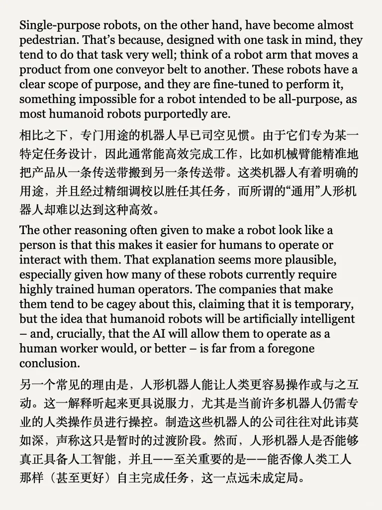
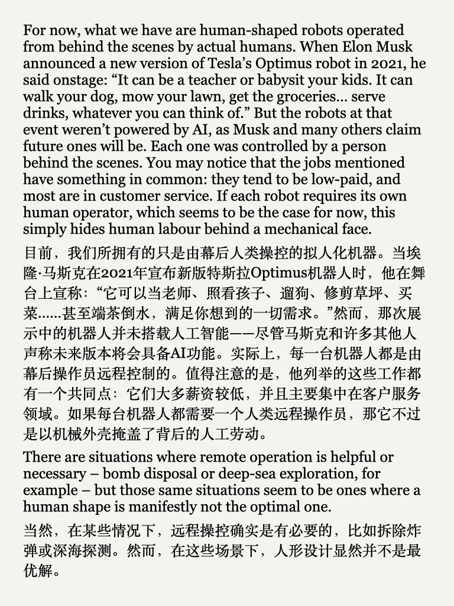
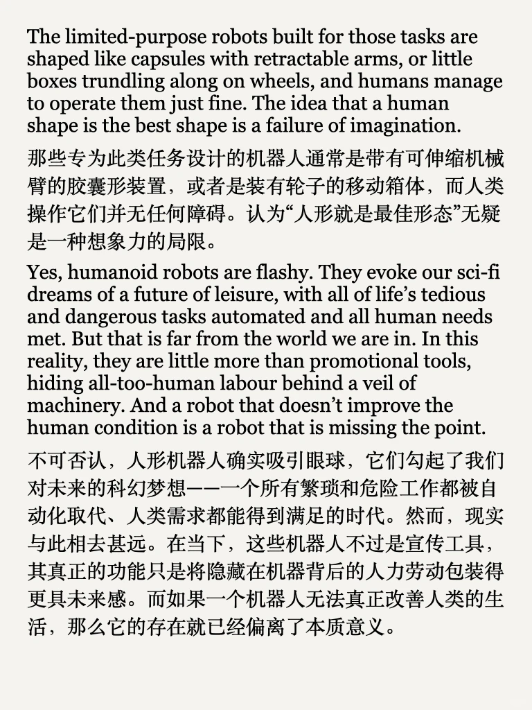
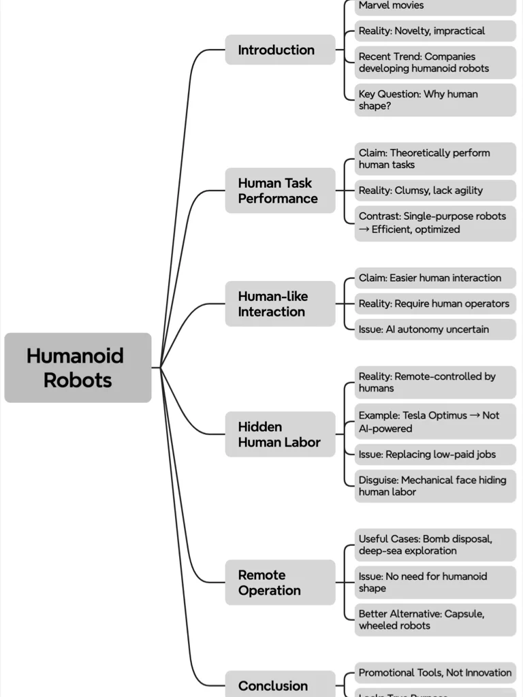
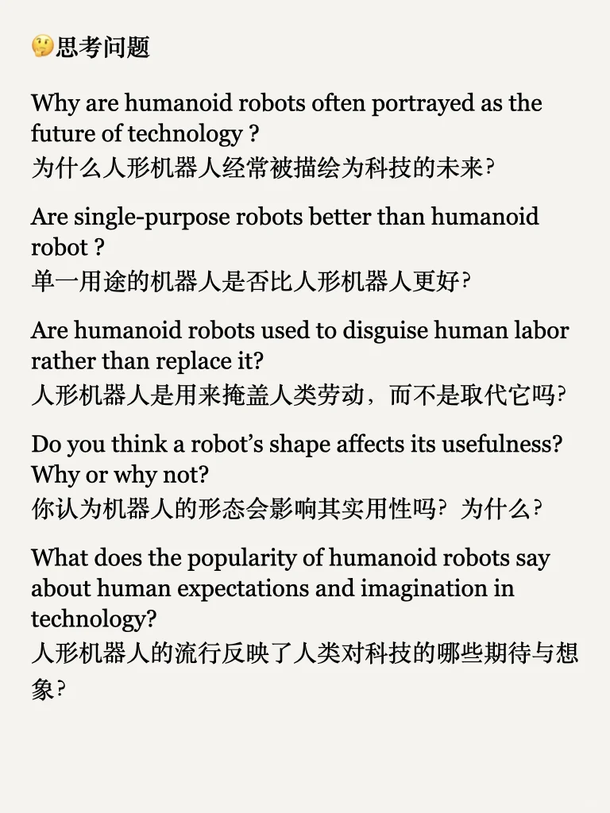
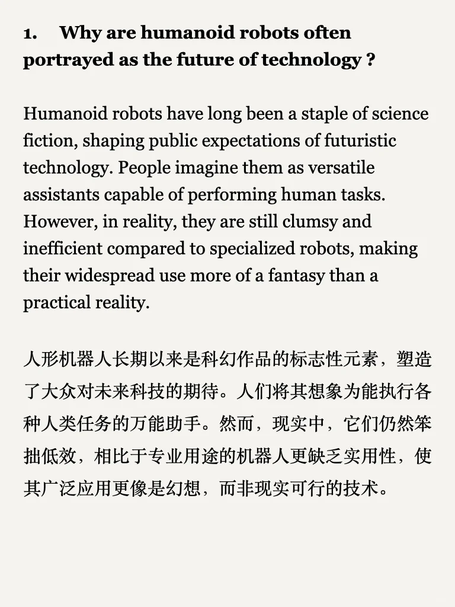
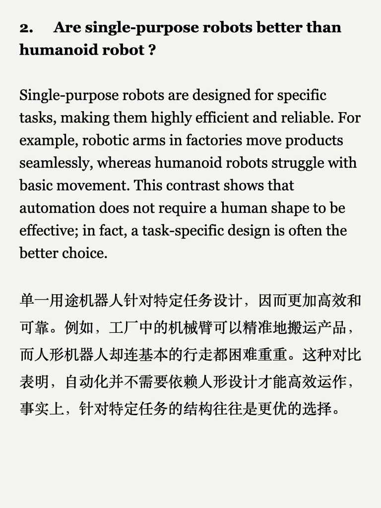

# 人形机器人究竟有什么用？是否只是噱头？

【外刊泛读】 了解热点，扩展知识面
每周精选最新外刊文章，提供原文与参考翻译，帮助你了解热点话题，提升英语泛读能力。
#英语阅读 #外刊翻译 #热点话题 #英语学习 #泛读提升 #外刊

## 图片
| 图1 | 图2 | 图3 | 图4 |
| --- | --- | --- | --- |
|  |  |  |  |
|  |  |  |  |
|  |  |   |   |

生成时间：2025-11-14 19:24:18