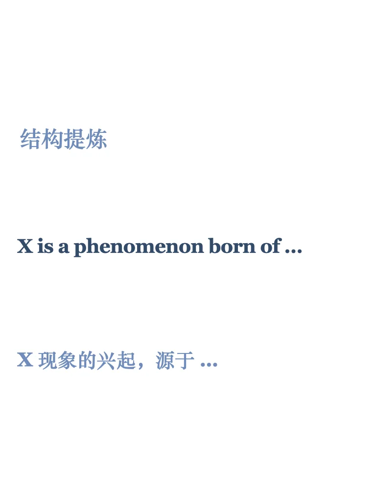

# 【外刊金句48期】轻松写出地道语感

英语作文不会写？写出的句子总有中式英语的影子？每周精选外刊亮点句式，手把手教你仿写，助力四六级、考研、雅思写作。
📚已更新至第48期，点击左下角获取完整PDF，持续更新中。
#英语地道表达   #每日英语   #外刊精读   #英语写作   #四六级   #考研英语   #雅思写作   #写作素材   #英语作文   #外刊

## 图片
| 图1 | 图2 | 图3 | 图4 |
| --- | --- | --- | --- |
|  |  |  |  |
|  |   |   |   |

生成时间：2025-11-14 19:23:07