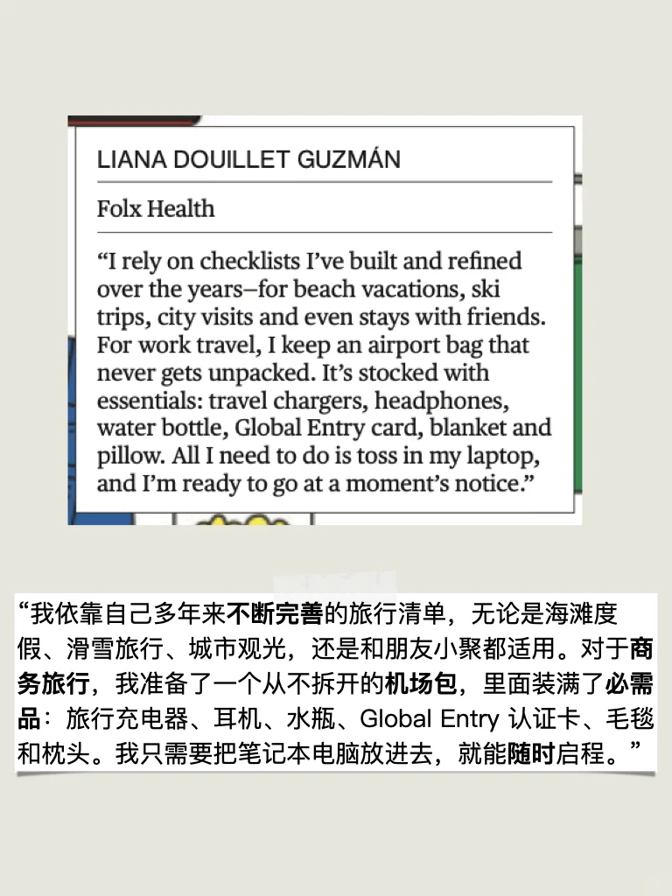
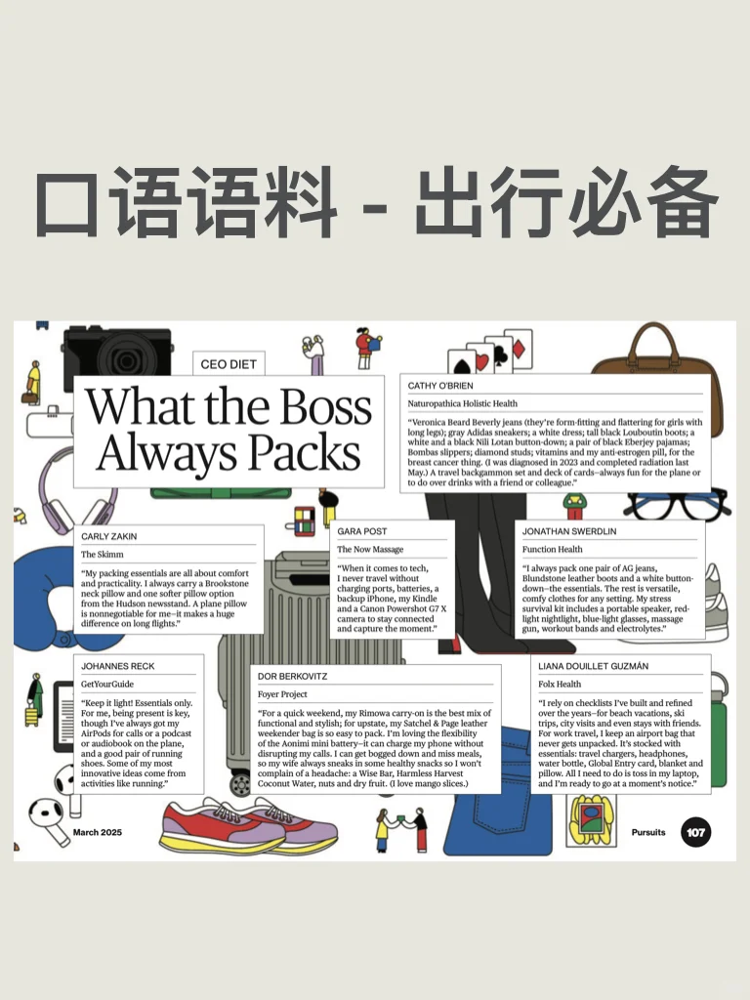
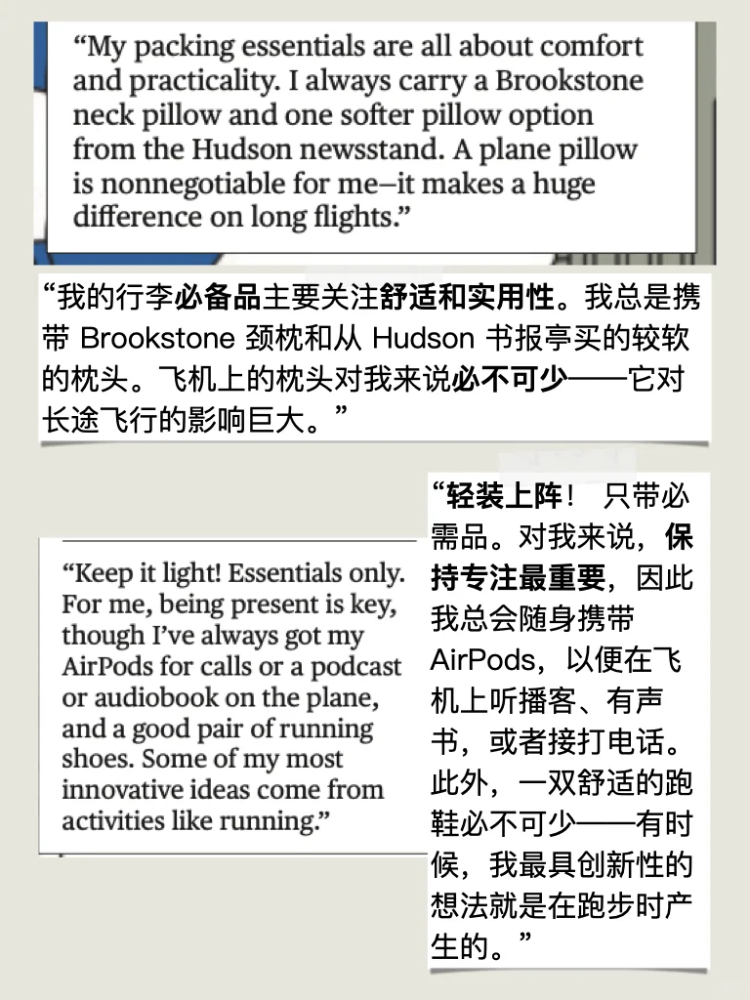
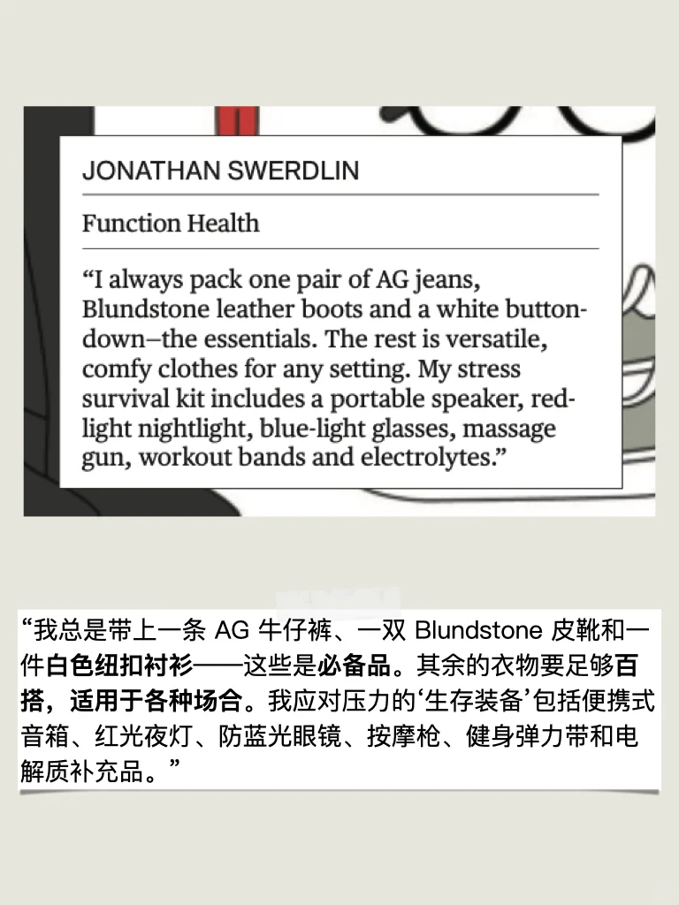
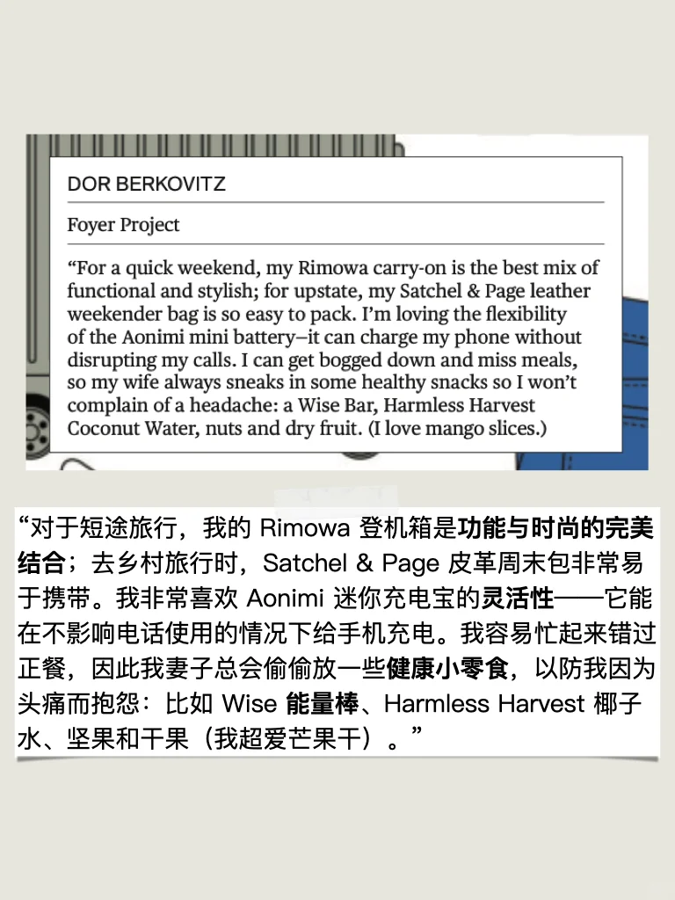

# 母语者如何描述自己出行必备的物品

#英语地道表达 #雅思备考 #生活英语 #雅思口语 #每日英语 #雅思 #四六级 #考研英语
From Bloomberg businessweek
短期备考雅思口语的同学，推荐学习我的就急包，六个主题快速看透题库，冲击高分💪

## 图片
| 图1 | 图2 | 图3 | 图4 |
| --- | --- | --- | --- |
|  |  |  |  |
|  |  |   |   |

生成时间：2025-11-14 19:16:29