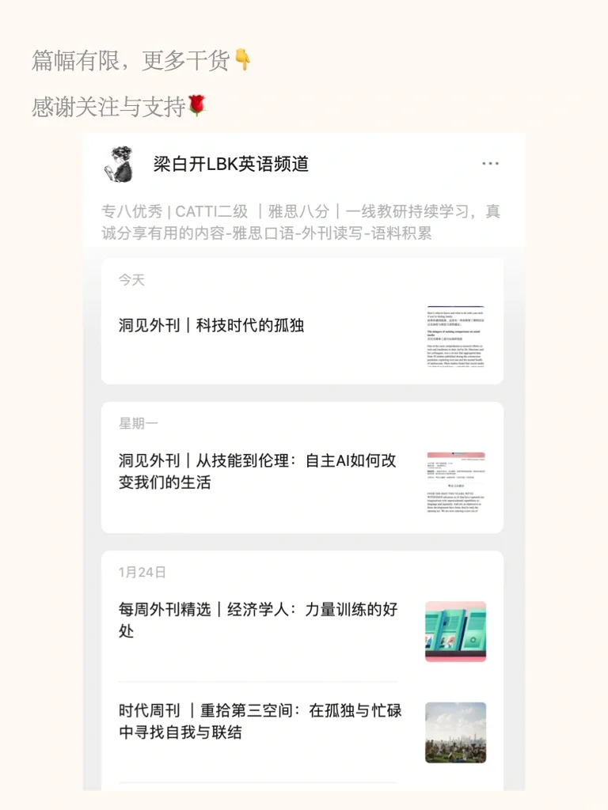
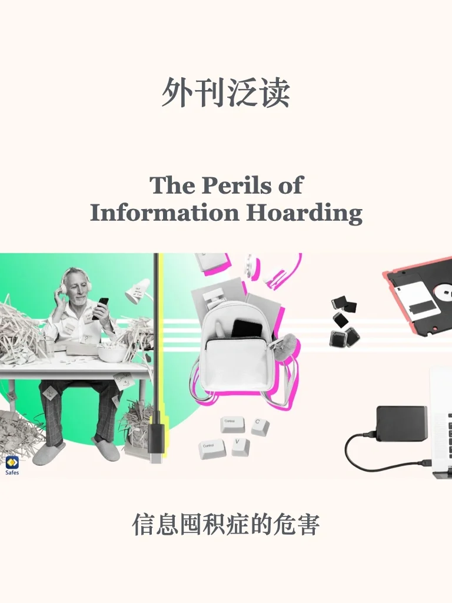
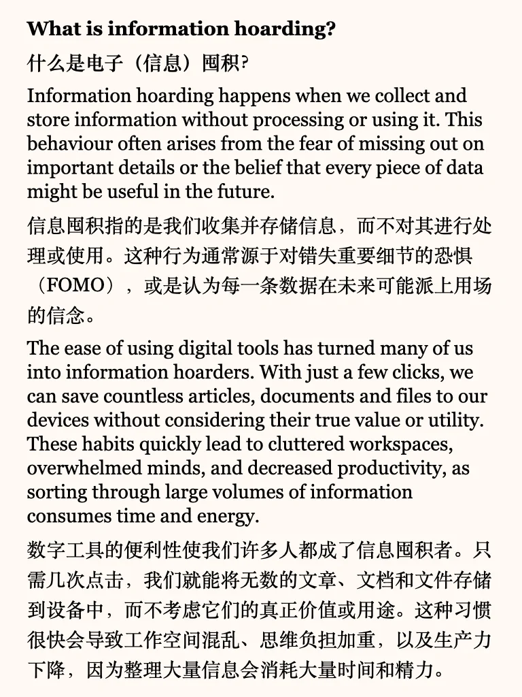
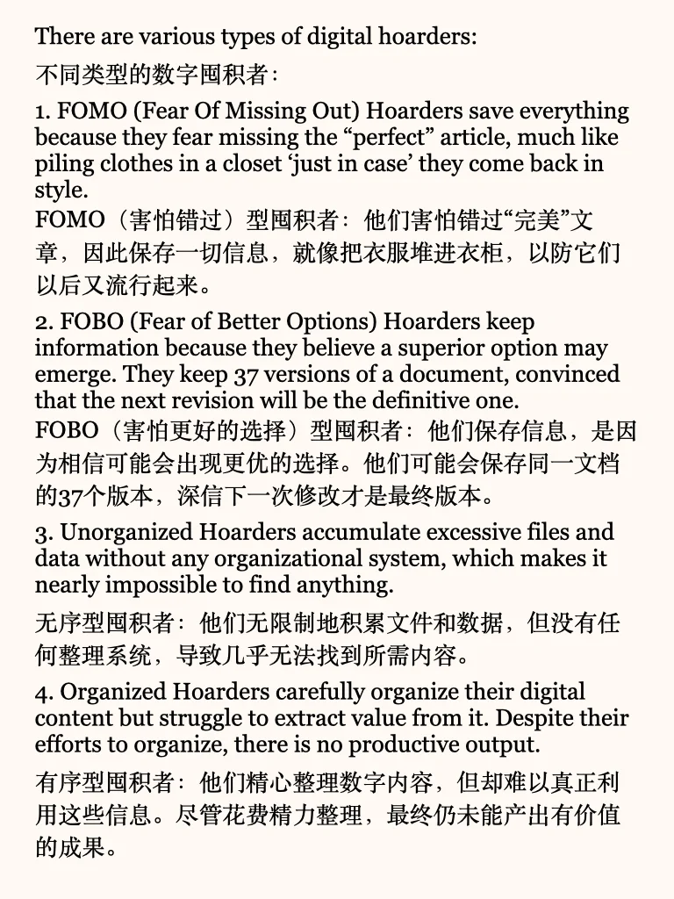
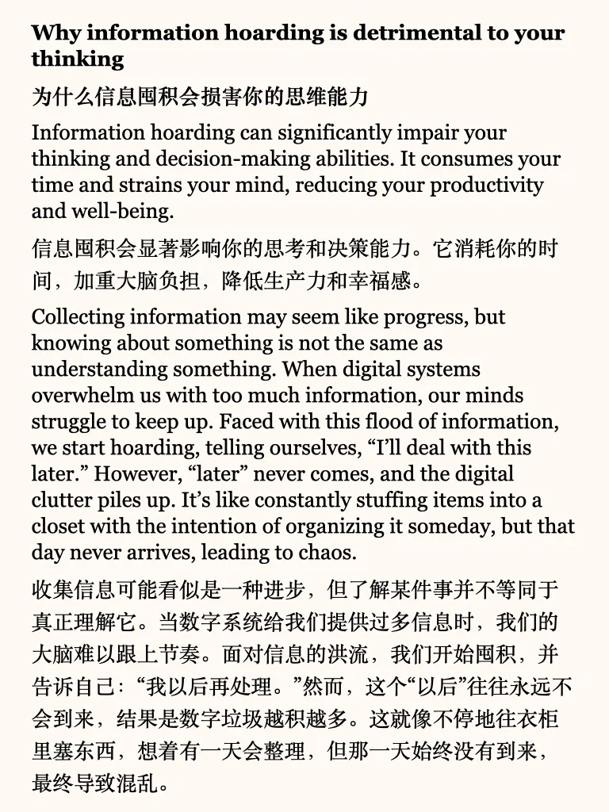
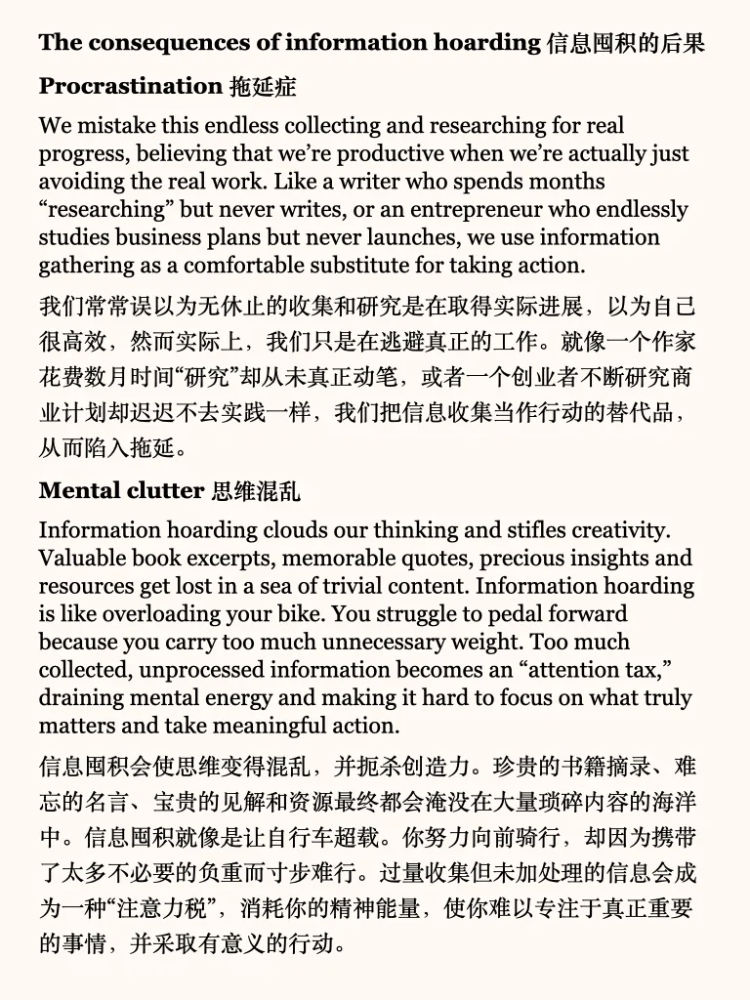
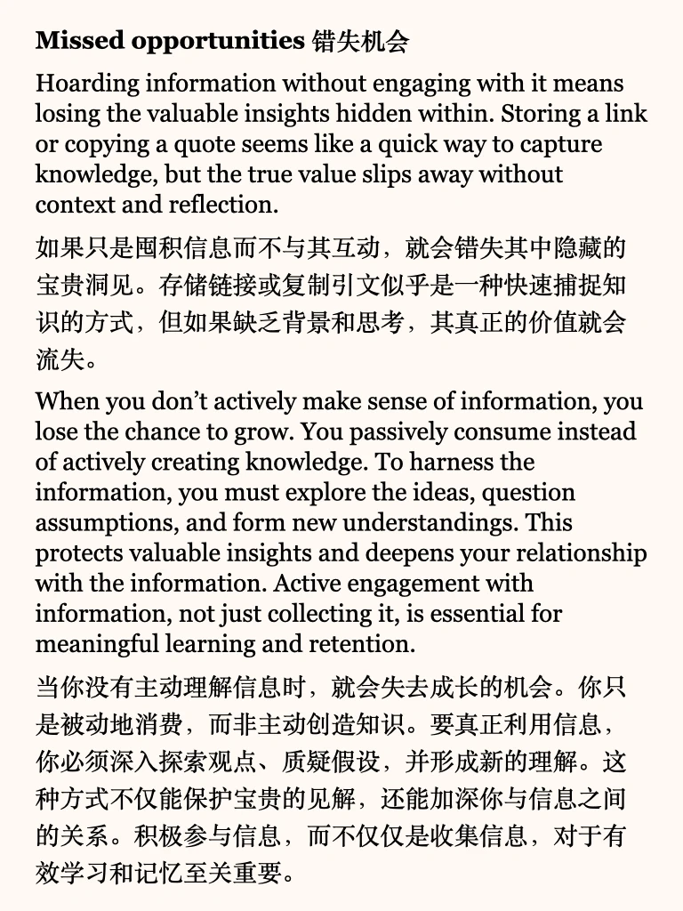
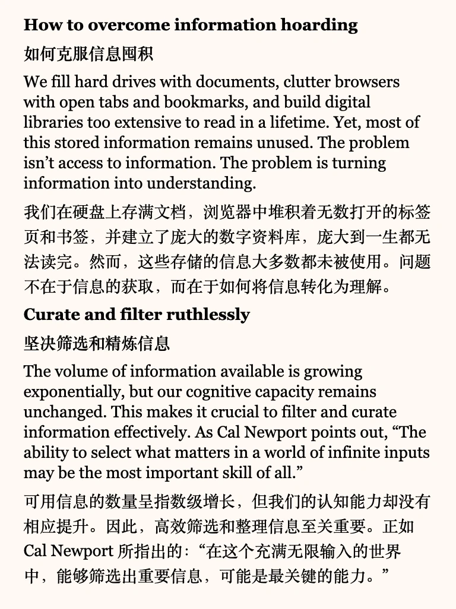
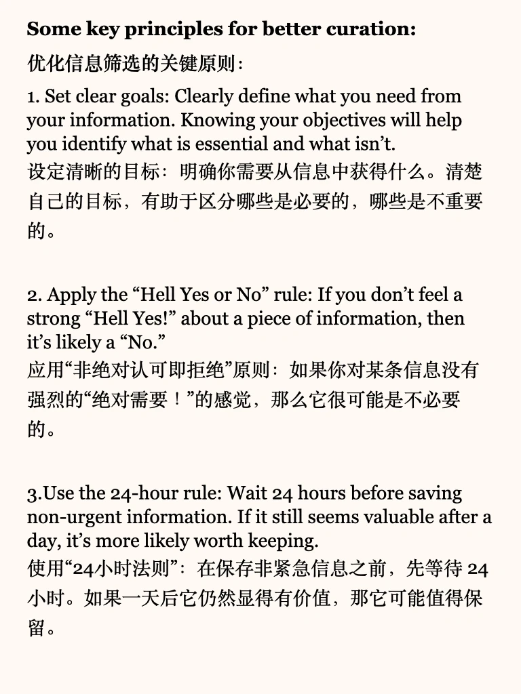
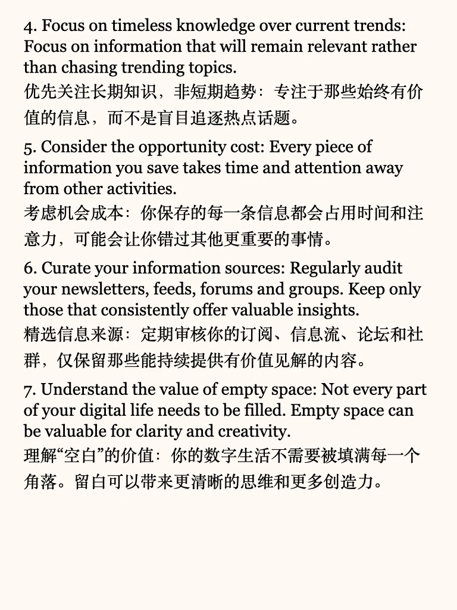

# 收集≠理解，信息囤积正在拖累你的大脑

#英语地道表达 #四六级 #考研英语 #外刊 #拒绝信息差 #系统性思维 #大脑 #思维的力量 #信息差#信息囤积

## 图片
| 图1 | 图2 | 图3 | 图4 |
| --- | --- | --- | --- |
|  |  |  |  |
|  |  |  |  |
|  |  |   |   |

生成时间：2025-11-14 19:14:14