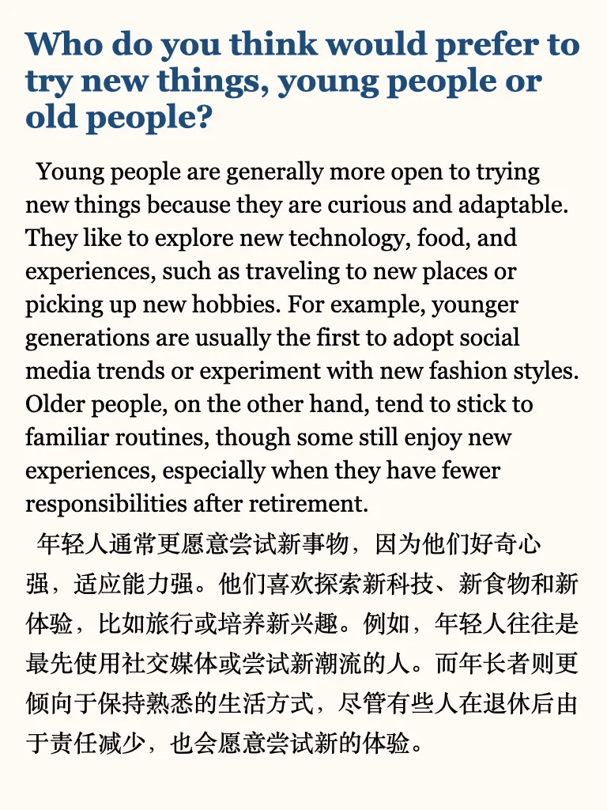
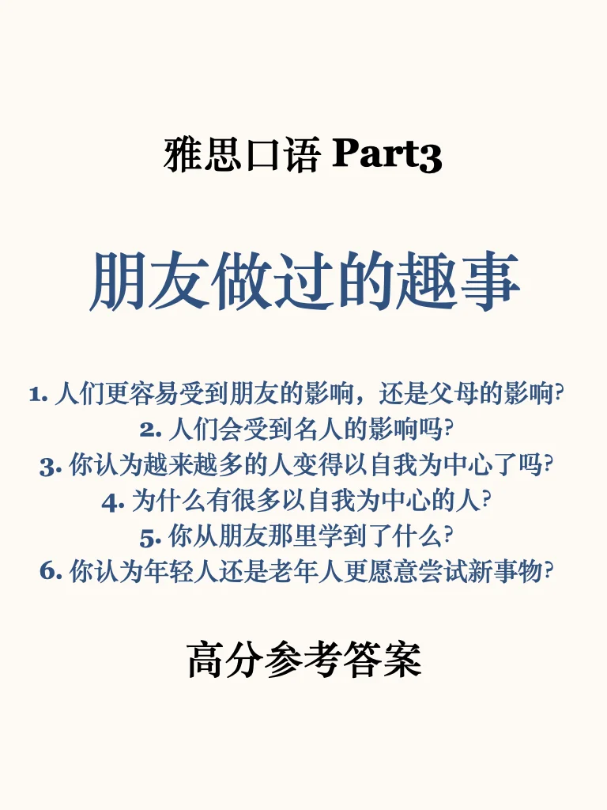
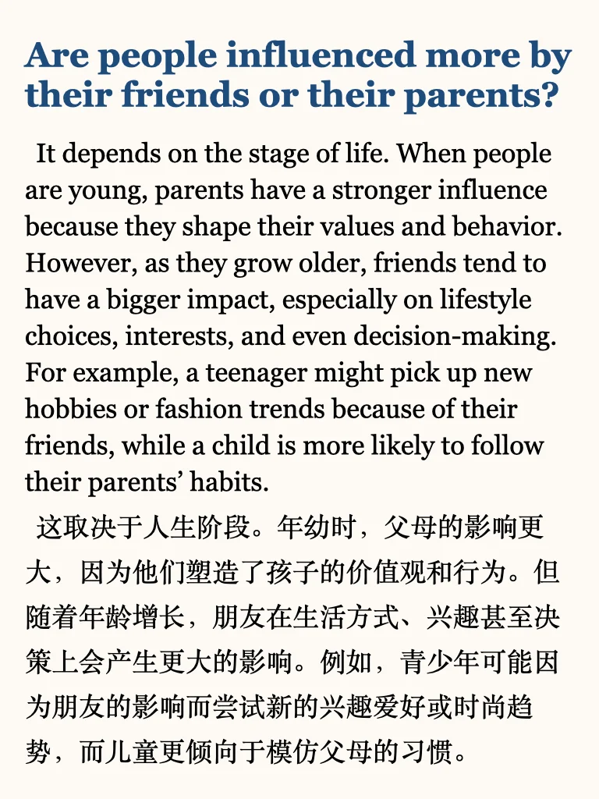
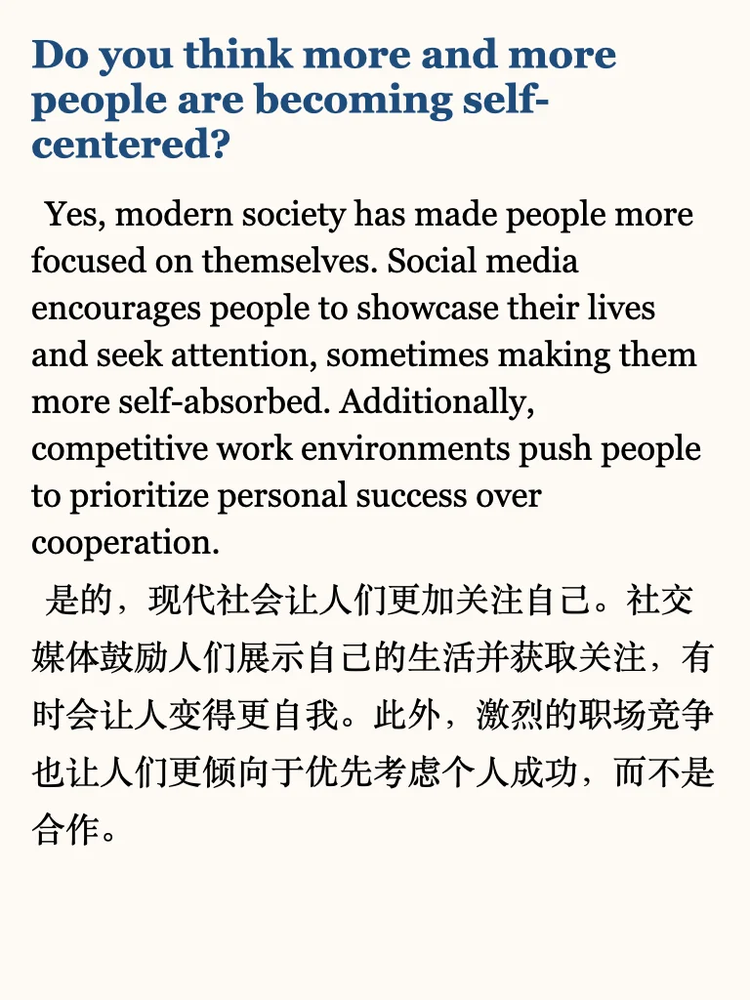
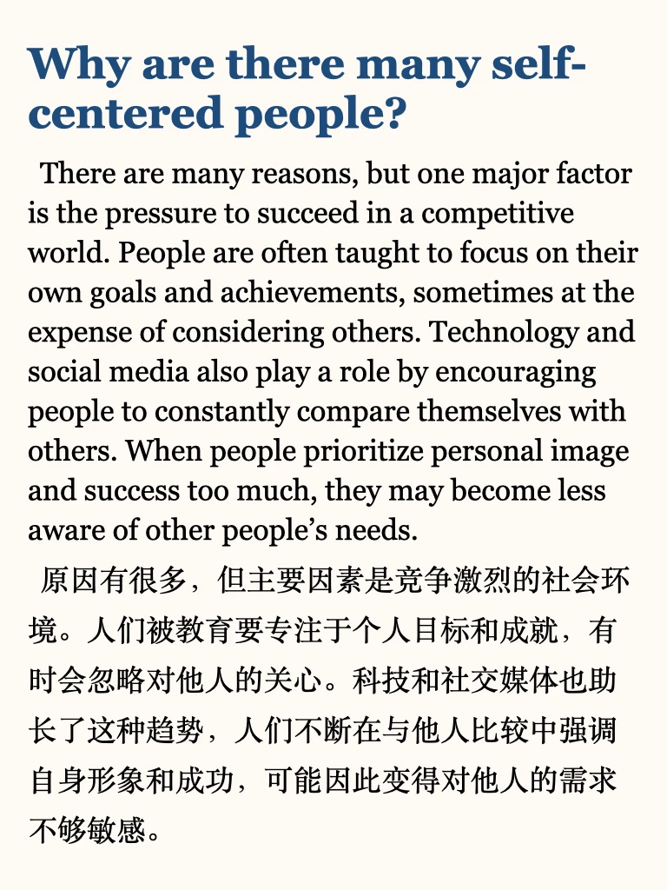
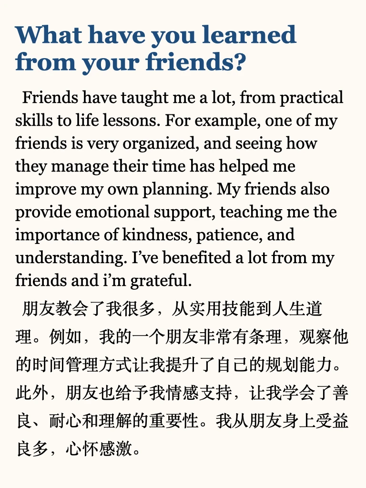

# 【高分必备】雅思口语提分｜Part 3高分参考

雅思口语part3是冲击高分选手的主要战场， 也可以是普通选手的逆袭环节，Part 3 问题怎么答？题目抽象没有思路怎么办？有想法说不清楚怎么办？
左下角get 上季度完整part3题目 ➕ 本季度更新，刷一遍高分参考答案，学思路，学词汇，自信应对。
	
短期备考的同学推荐学习我的救急包，六个主题看透题库冲击高分💪
#雅思备考 #雅思口语 #雅思口语part3 #雅思口语高分示范 #雅思口语新题 #雅思口语part3答案

## 图片
| 图1 | 图2 | 图3 | 图4 |
| --- | --- | --- | --- |
|  |  |  |  |
|  |  |  |   |

生成时间：2025-11-14 19:19:49