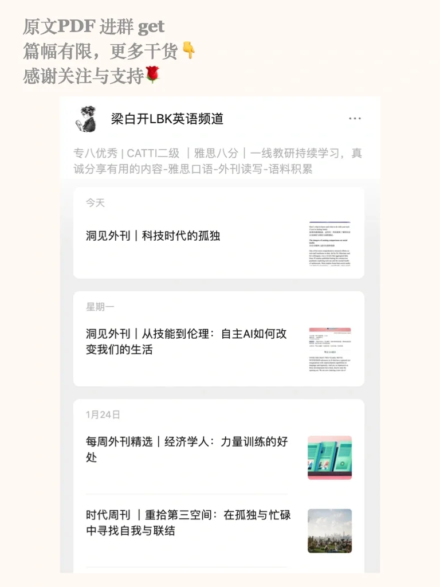
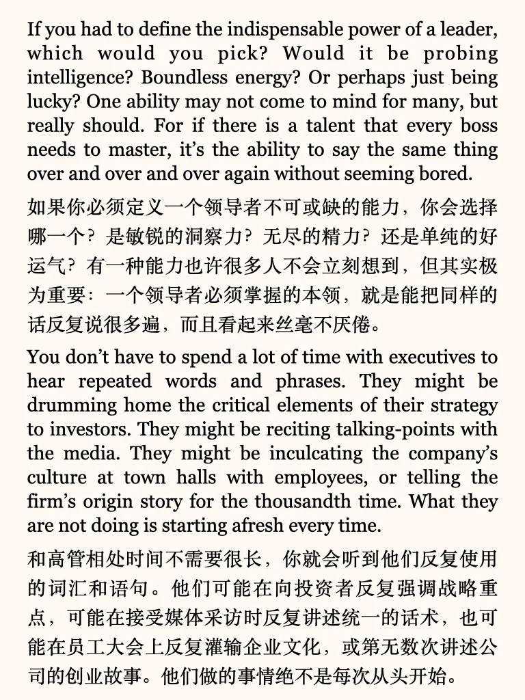
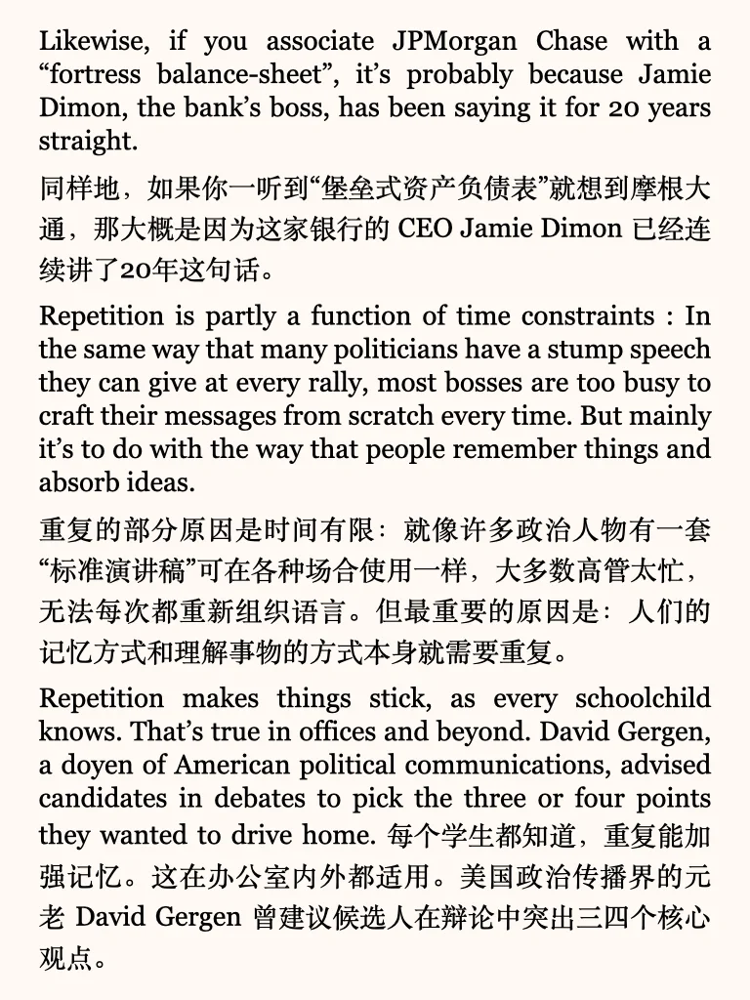
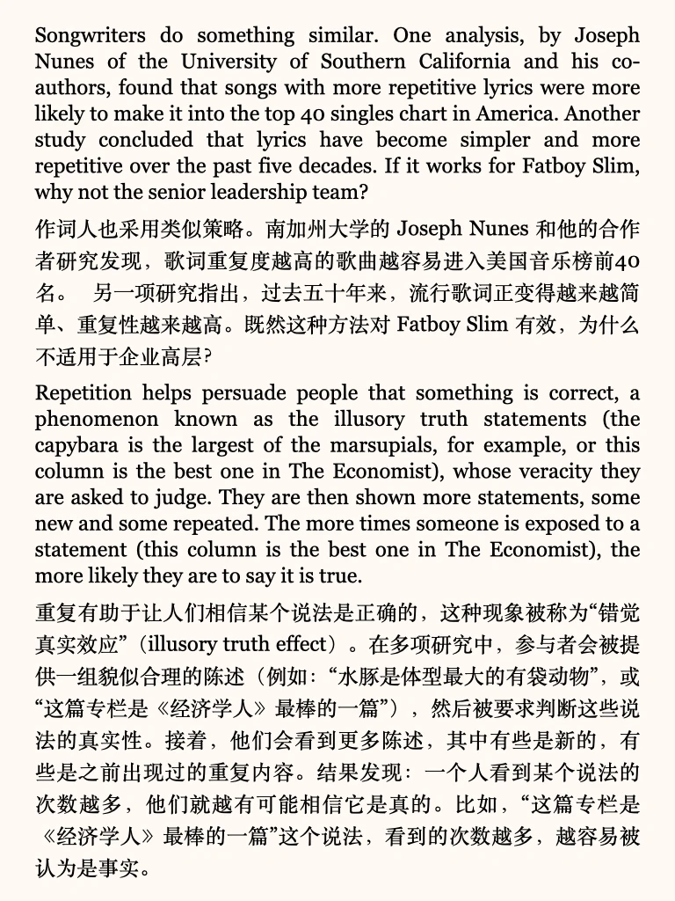
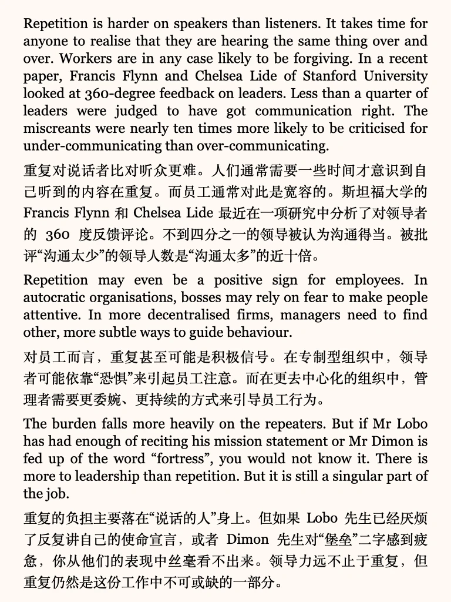

# 【外刊泛读】重复行为在职场中的重要性

#英语地道表达 #考研英语 #英文学习 #职场影响力 #职场英语 #英语阅读打卡 #商务英语职场英语 #外刊 #英文阅读
更多干货内容，丰富外刊资源，见最后一页🌹
平时分享的内容受篇幅限制，很多是段落节选或者词汇讲解
我把平时阅读的文章从期刊、网页中筛选出来，以PDF格式保存
想更阅读更完整的外刊原文，欢迎加入群聊🎉

## 图片
| 图1 | 图2 | 图3 | 图4 |
| --- | --- | --- | --- |
|  |  |  |  |
|  |  |  |   |

生成时间：2025-11-14 19:06:24