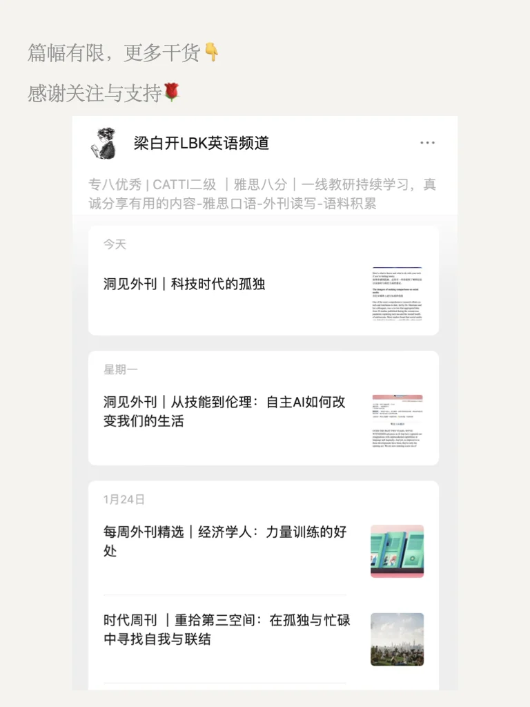
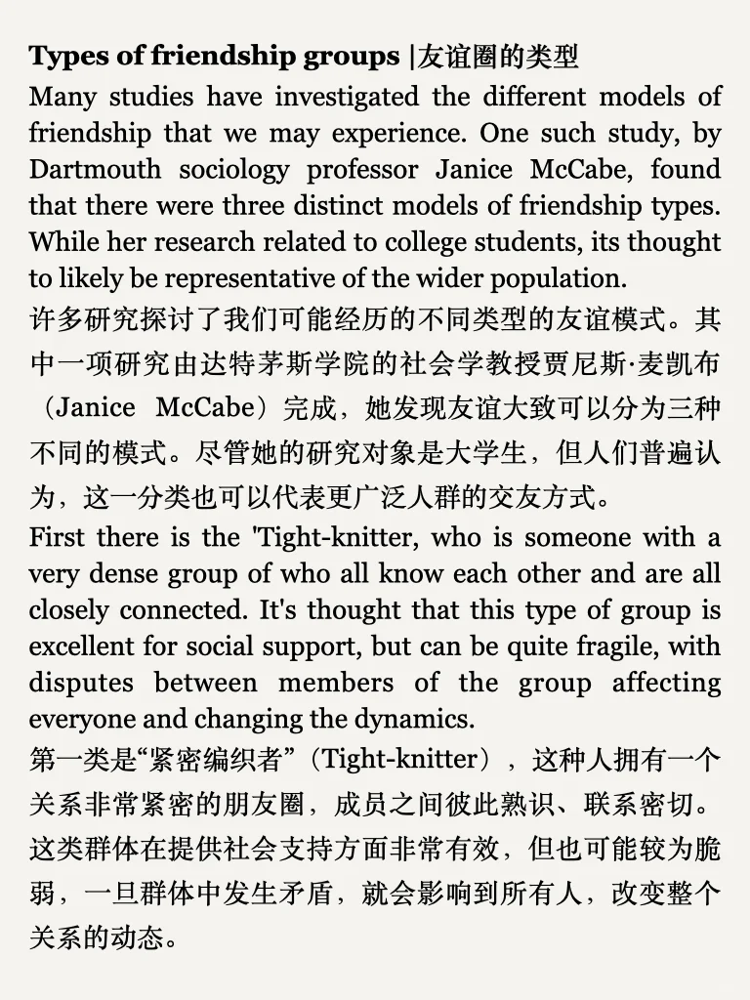
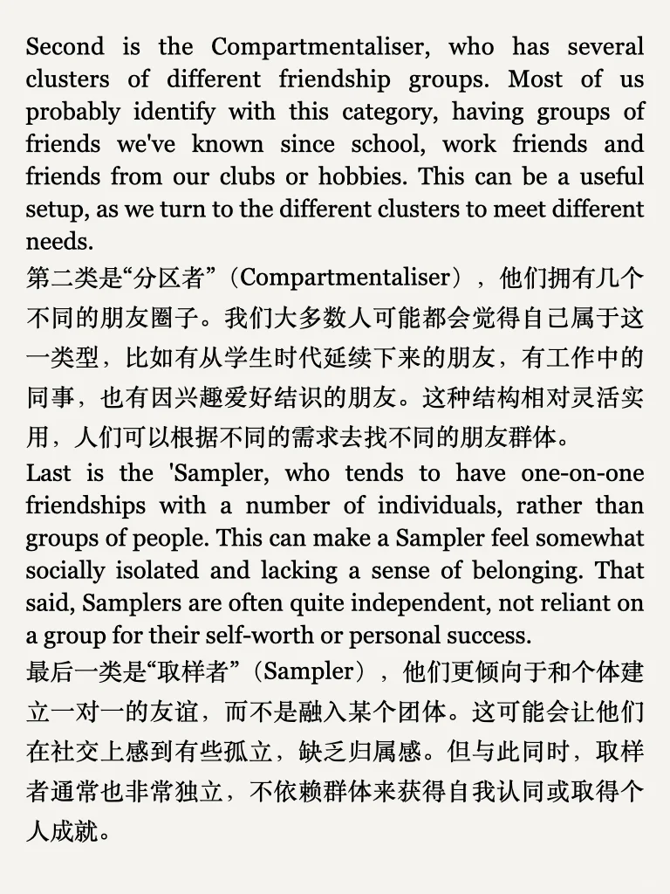

# 外刊泛读｜友谊的力量

来自 psychology now
也是雅思口语中常问的话题方向，一起来阅读吧
	
平时分享的内容受篇幅限制，很多是段落节选或者词汇讲解
我把平时阅读的文章从期刊、网页中筛选出来，以PDF格式保存
想更阅读更完整的外刊原文，欢迎加入群聊🎉
#英语泛读 #外刊阅读 #英语翻译 #阅读提升 #英语学习 #考研英语 #四六级 #热点话题 #英语写作 #阅读能力提升

## 图片
| 图1 | 图2 | 图3 | 图4 |
| --- | --- | --- | --- |
|  |  |  |  |
|  |  |  |  |
|  |   |   |   |

生成时间：2025-11-14 18:56:25