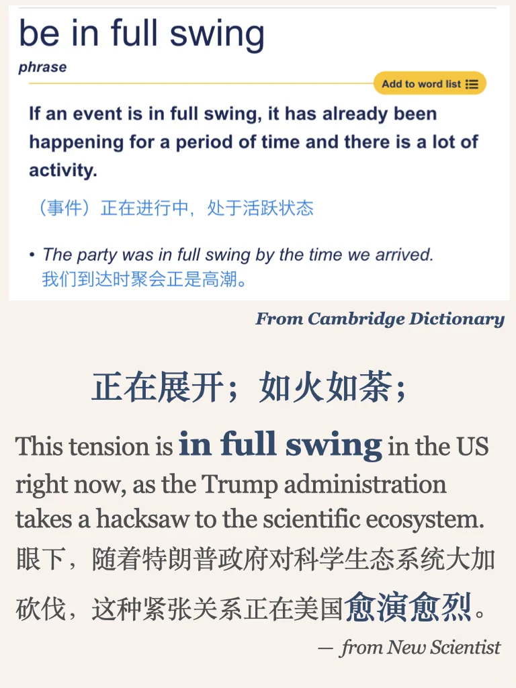

# 积累一个外刊中的地道表达～

精选外刊实用习语，扩展读写地道词汇 
#英语地道表达     #英语翻译     #英语俚语     #外刊精读     #英语美文     #每日一词     #翻译学习   #考研英语   #四六级   #实用英语

## 图片
| 图1 | 图2 | 图3 | 图4 |
| --- | --- | --- | --- |
|  |  |  |   |

生成时间：2025-11-14 18:49:46