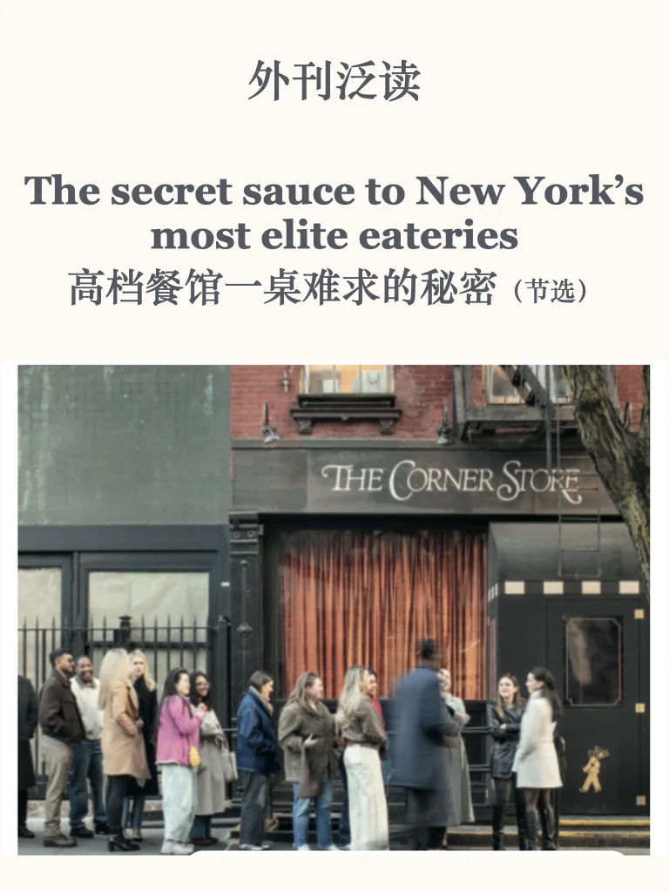
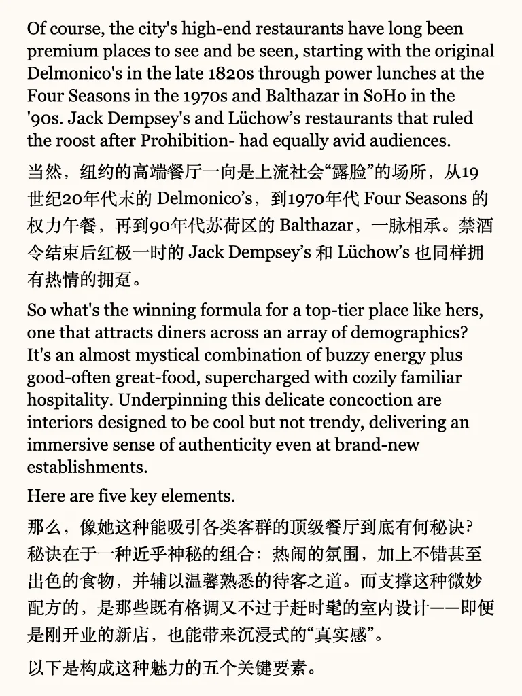
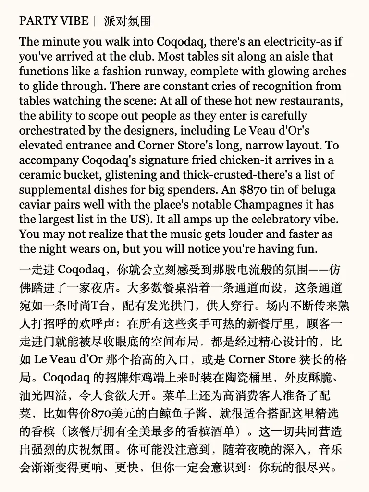
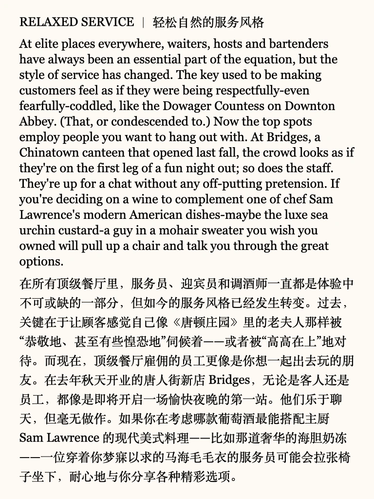
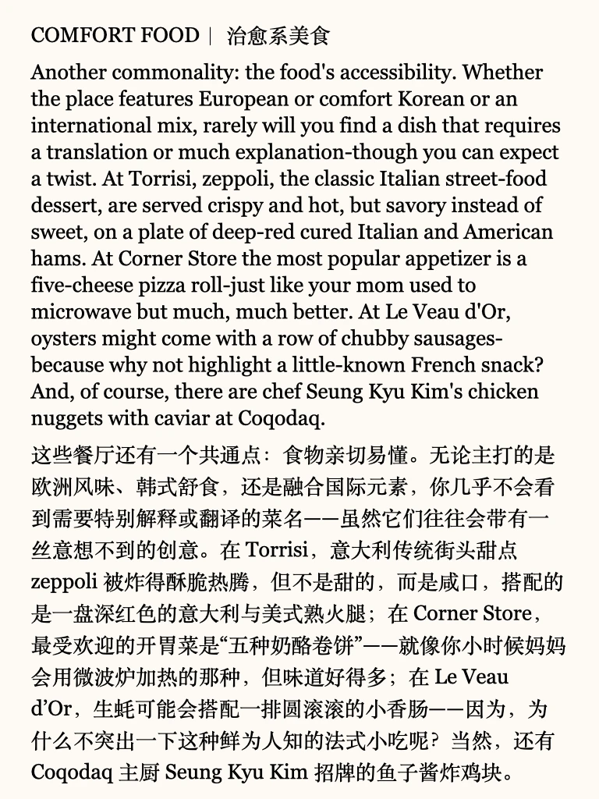
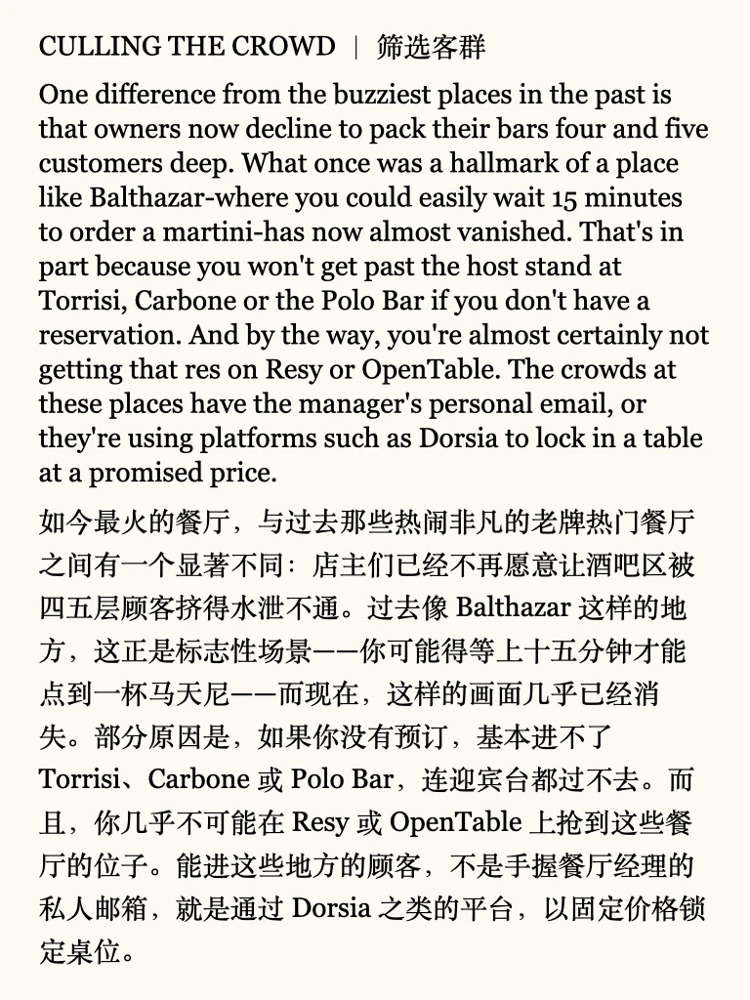
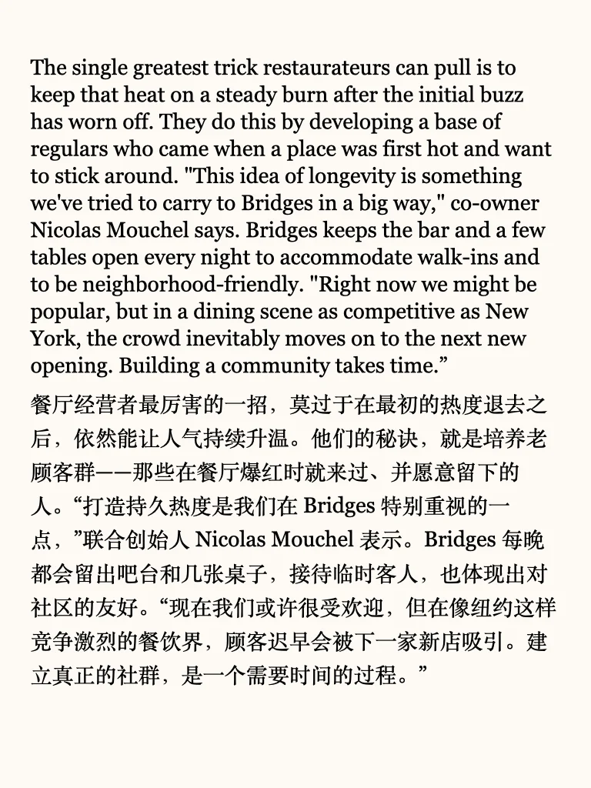

# 外刊泛读｜纽约高档餐厅的秘诀

#英语泛读 #外刊阅读 #英语翻译 #阅读提升 #英语学习 #考研英语 #四六级 #热点话题 #英语写作 #阅读能力提升 #英语地道表达

## 图片
| 图1 | 图2 | 图3 | 图4 |
| --- | --- | --- | --- |
|  |  |  |  |
|  |  |  |  |
|  |  |   |   |

生成时间：2025-11-14 18:47:32