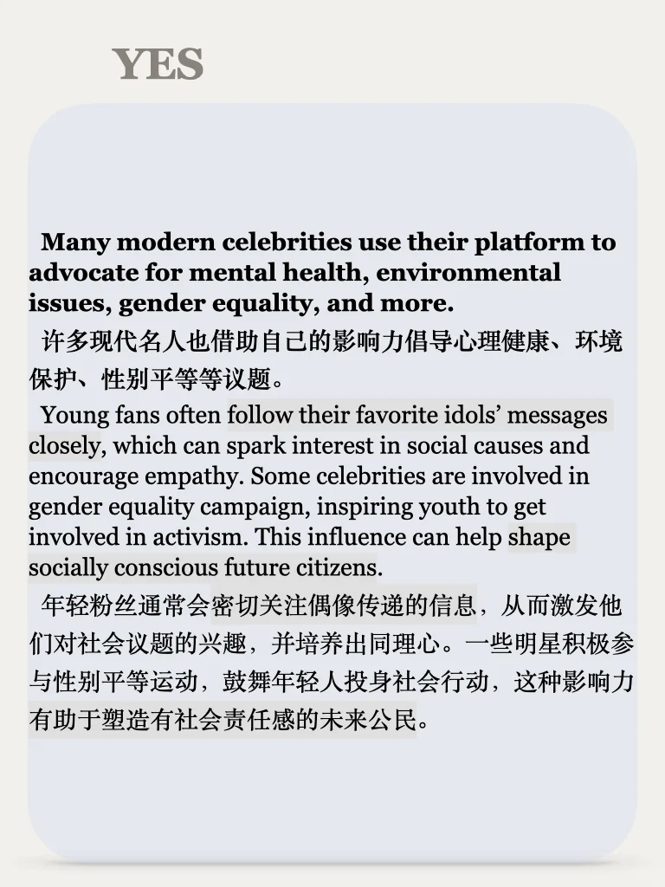
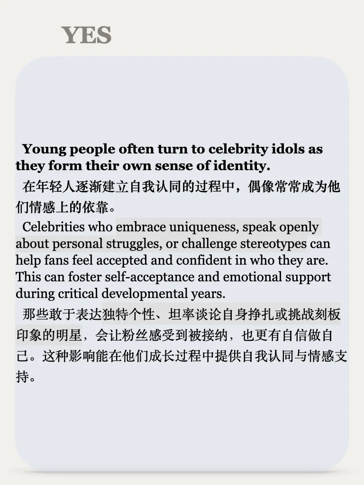
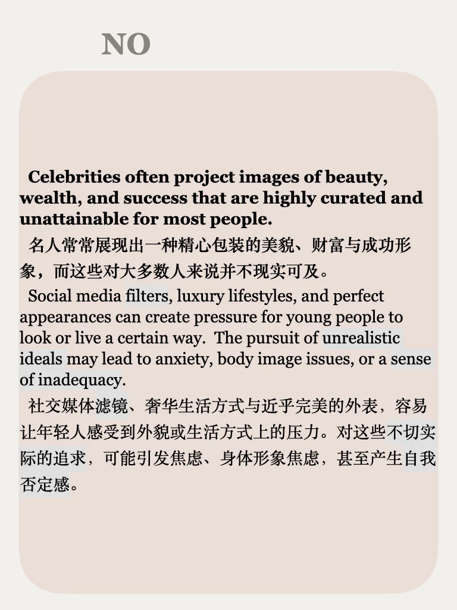

# 思辨训练73期｜说出你的观点

偶像影响的利弊，你怎么看？
思辨栏目每周一更，左下角get前73期资料
（附赠《立场》丛书）
#英语地道表达 #四六级 #英语写作 #考研英语 #语言表达 #辩论 #观点与角度 #创造性表达 #提升觉察力 #表达能力 #雅思 #雅思口语

## 图片
| 图1 | 图2 | 图3 | 图4 |
| --- | --- | --- | --- |
|  |  |  |  |
|  |  |  |   |

生成时间：2025-11-14 18:40:55