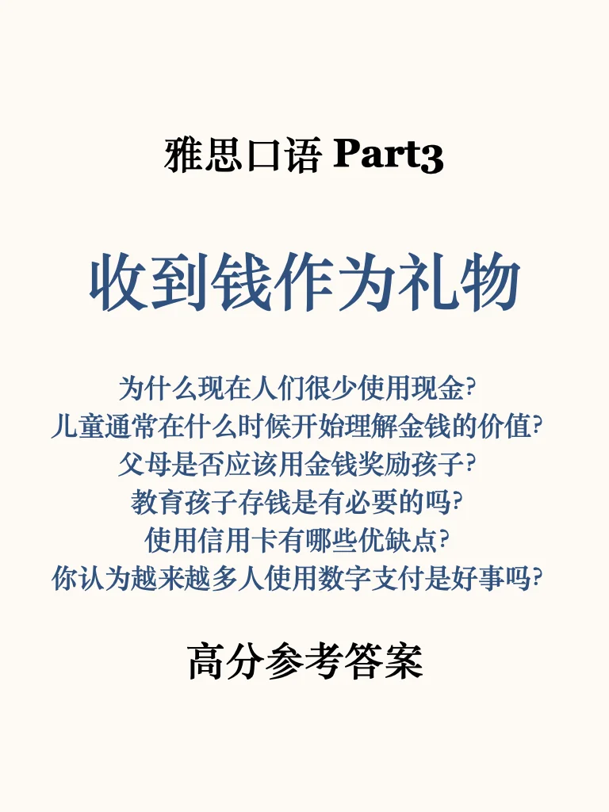
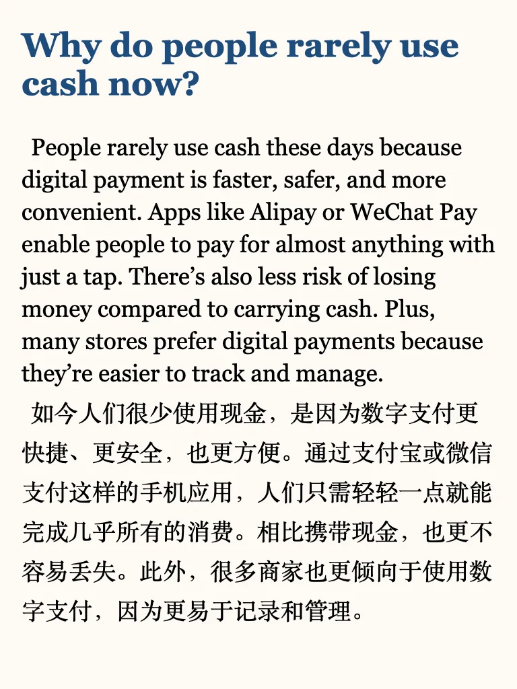
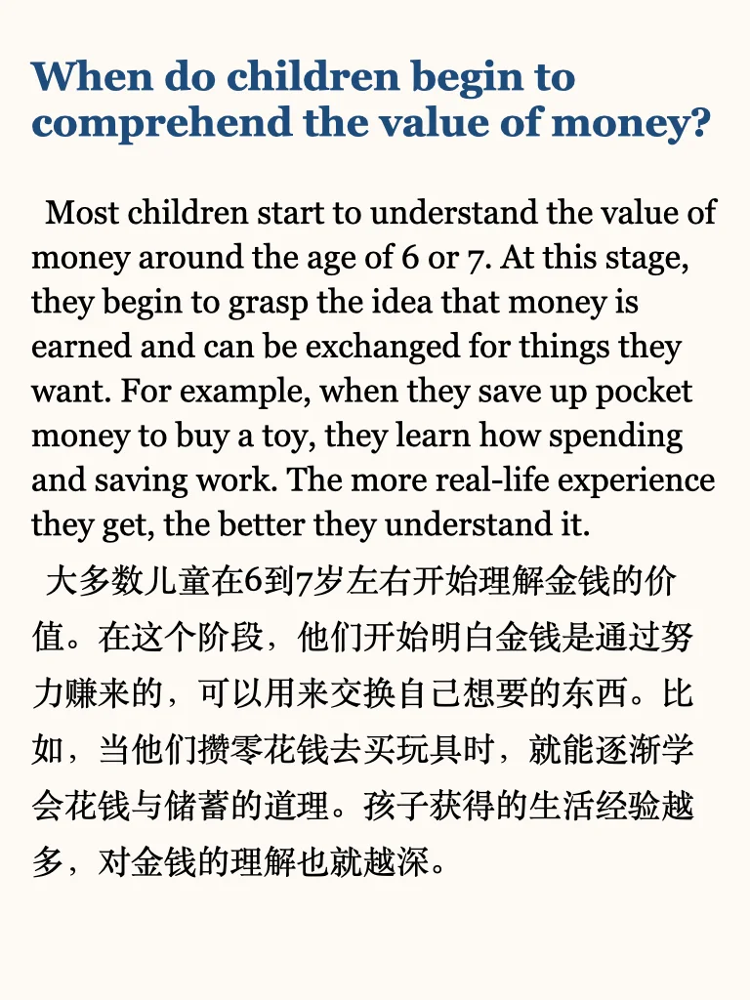
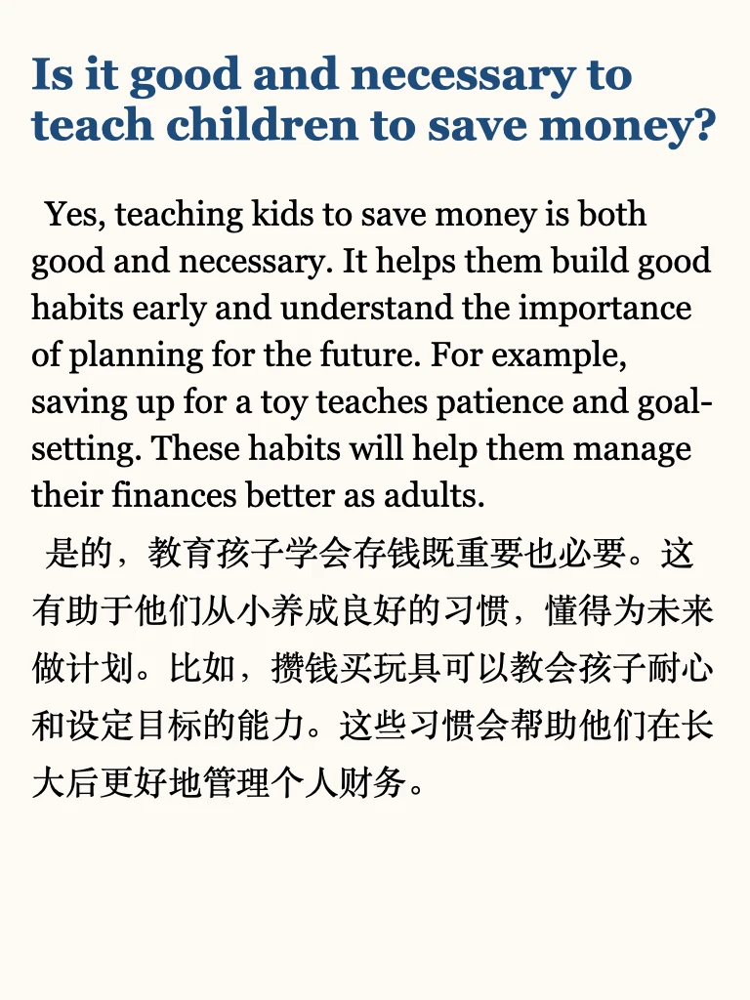
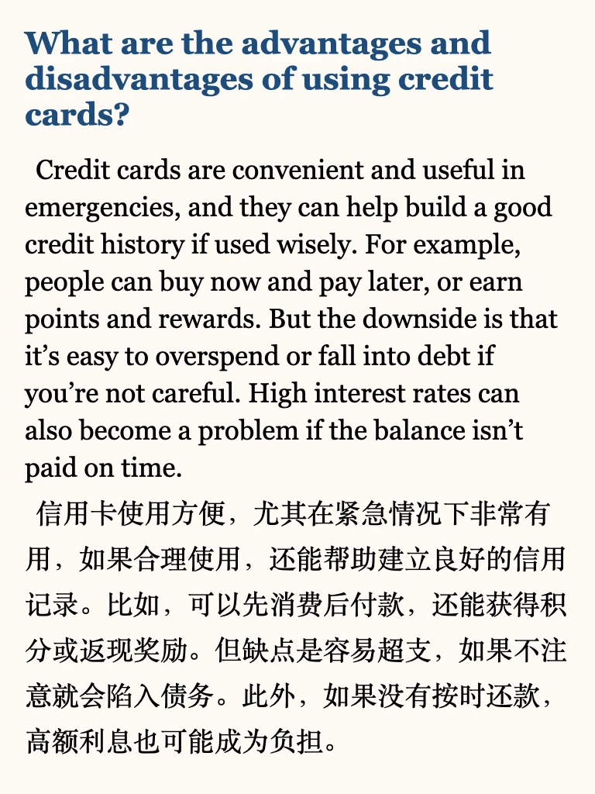

# 雅思口语part3新题参考答案

新题还在更，part3答案等稳定一些再上架
推荐短期备考的同学，参考6天救急包，锻炼思维，提升能力💪
#雅思口语 #一起练口语 #英语地道表达 #雅思 #雅思备考 #口语 #雅思口语换题 #雅思口语part3 #雅思口语part3高分答案

## 图片
| 图1 | 图2 | 图3 | 图4 |
| --- | --- | --- | --- |
|  |  |  |  |
|  |  |  |   |

生成时间：2025-11-14 18:37:34