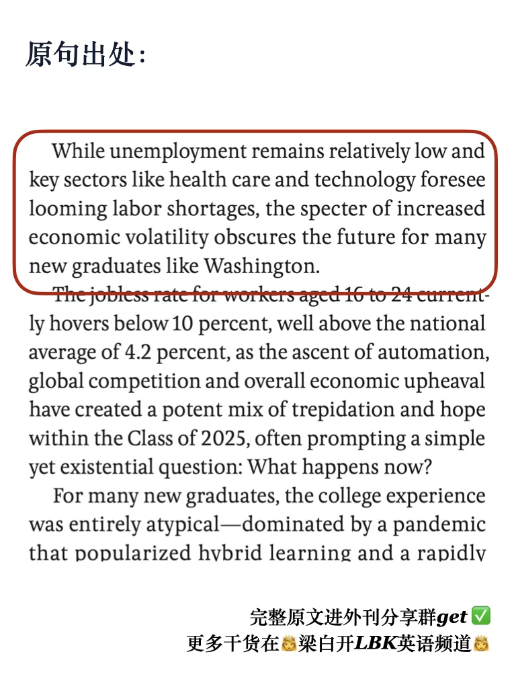
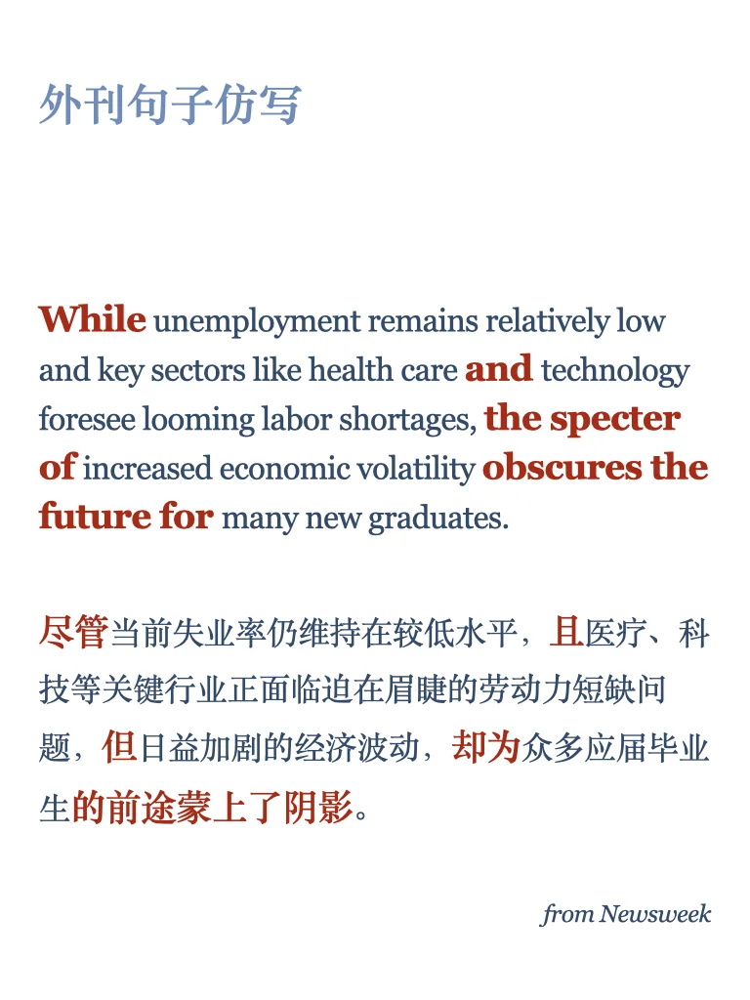
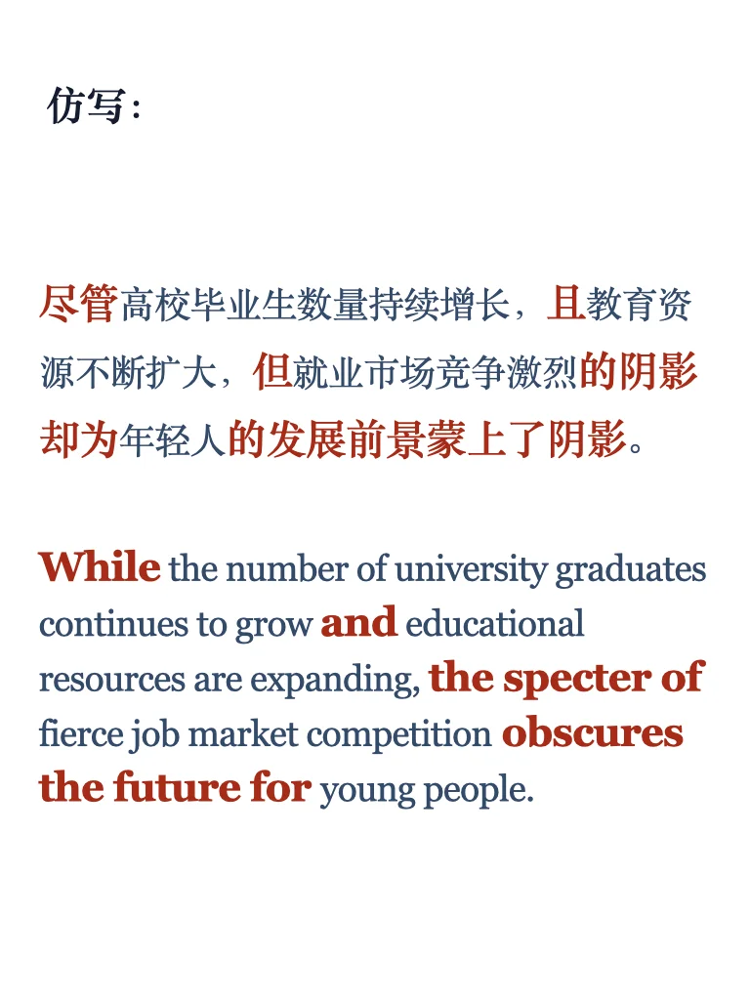

# 外刊句子仿写57期｜前景不乐观

从外刊句子中学习句法结构与逻辑，提升写作表达💪
每周一更，左下角获取PDF，持续更新
精选的一些外刊原文大家可以进群get～
#英语地道表达 #四六级 #翻译学习 #每日英语 #英语写作 #雅思 #外刊精读 #考研英语 #写作练习 #仿写

## 图片
| 图1 | 图2 | 图3 | 图4 |
| --- | --- | --- | --- |
|  |  |  |  |
|  |   |   |   |

生成时间：2025-11-14 15:46:13