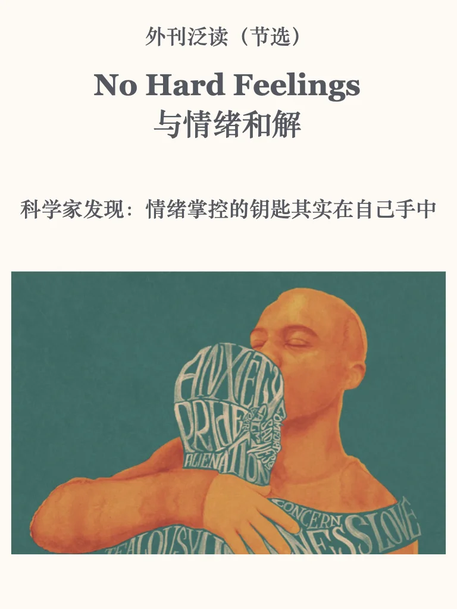
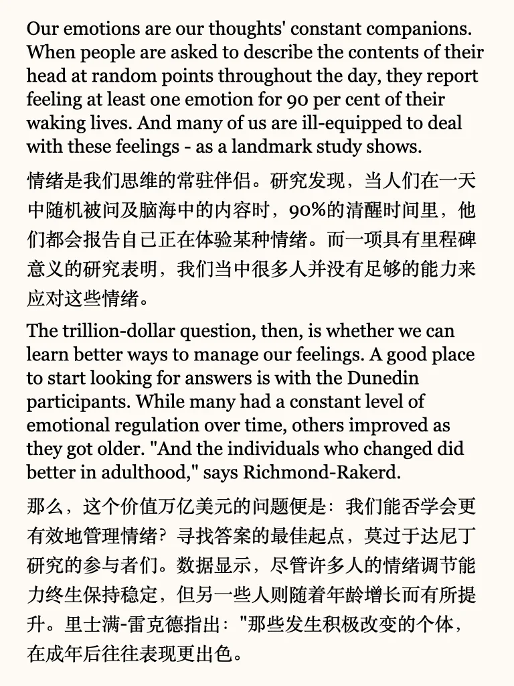
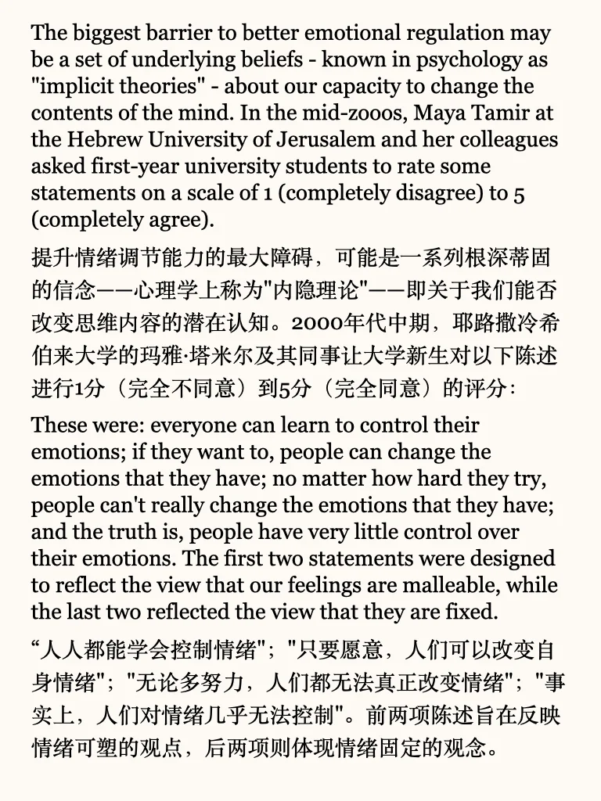
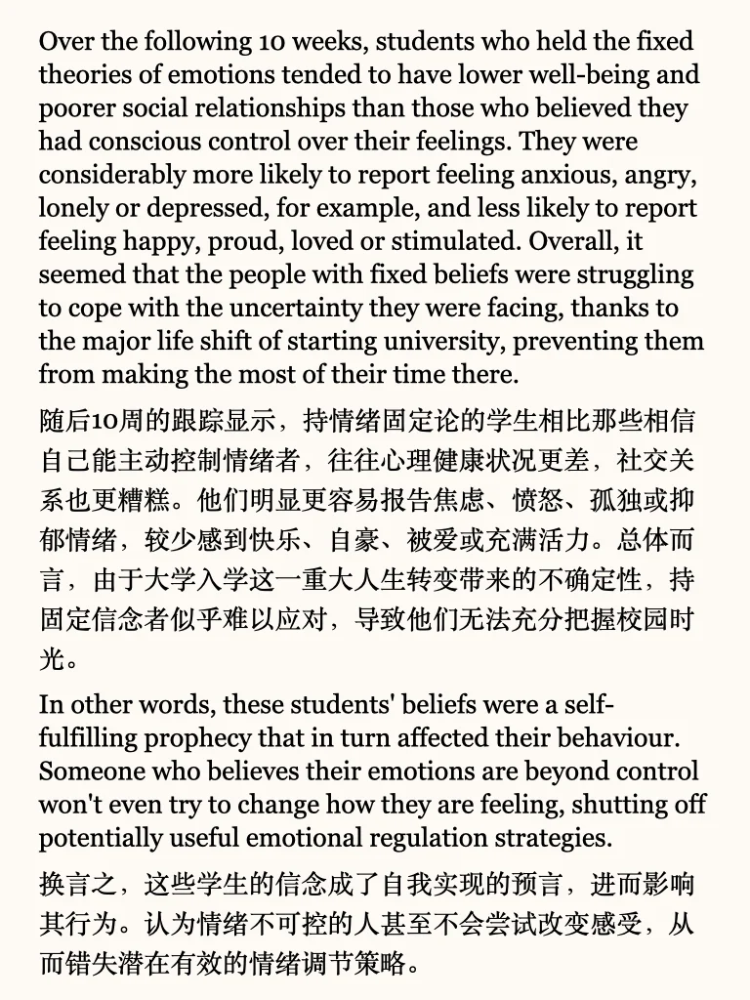
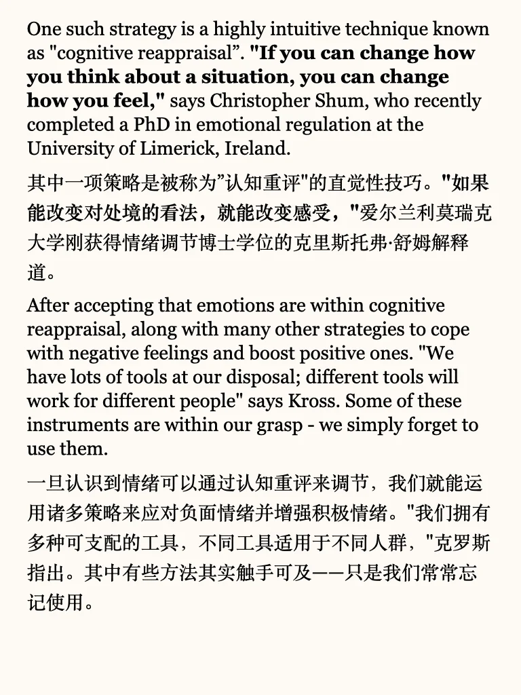
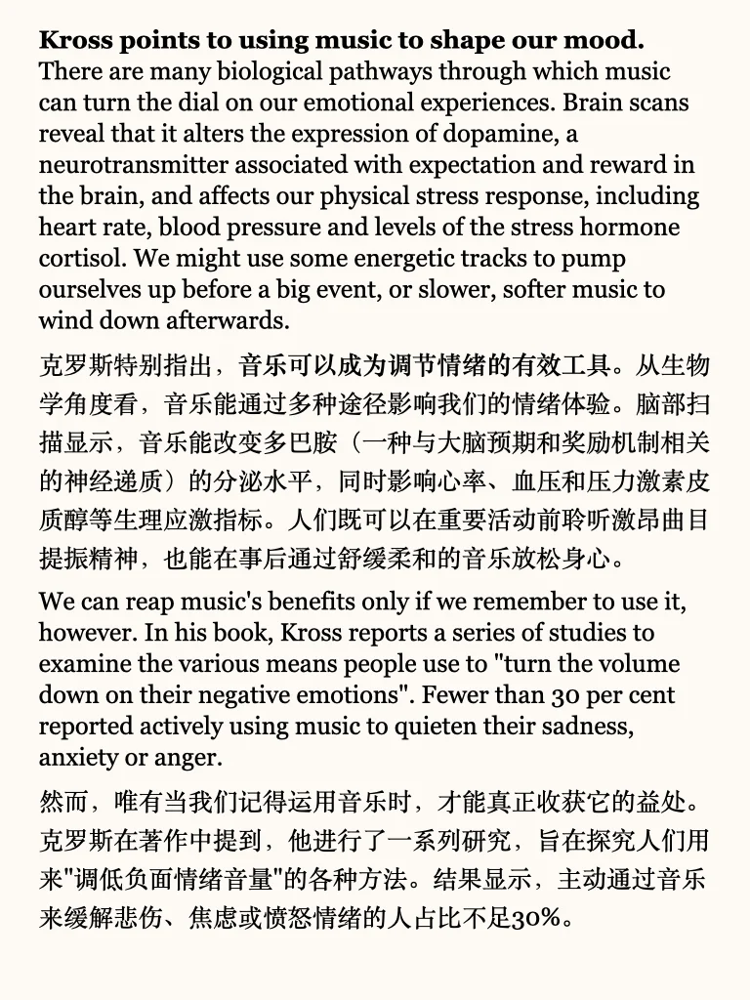
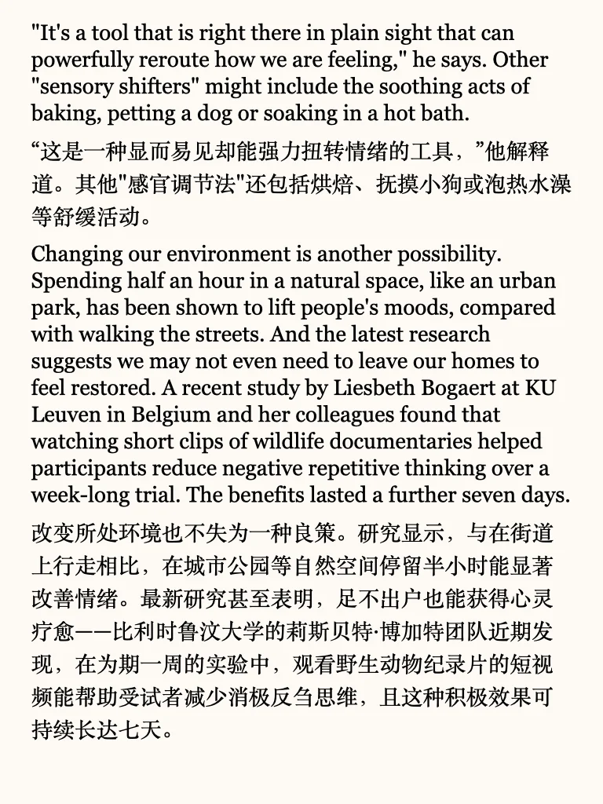
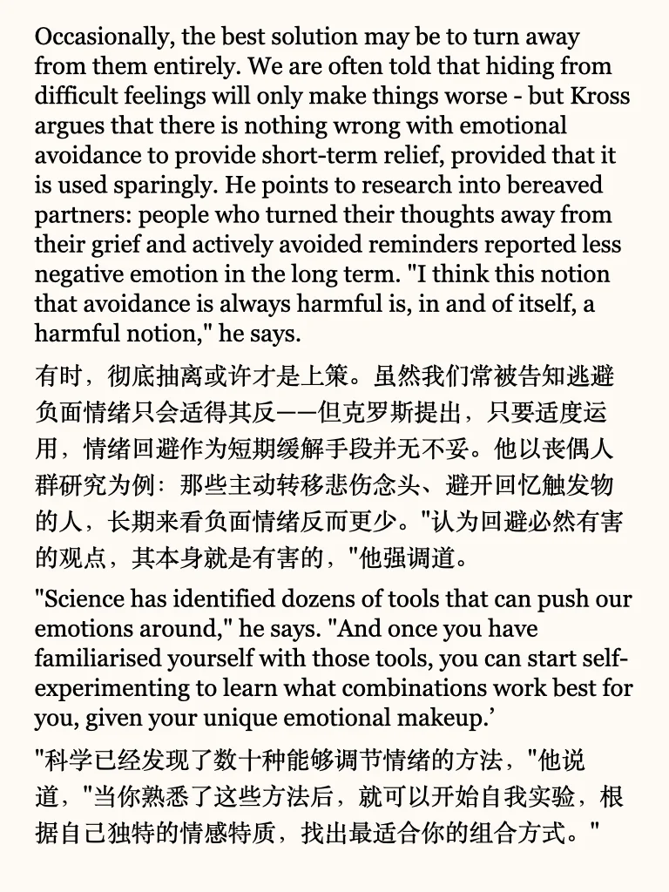

# 掌控情绪，而不是被情绪左右

音乐、自然、适当逃离，都可以有效调整情绪
最重要的，还是承认自己对情绪的主权
#英语地道表达 #情绪的力量 #稳定的情绪 #情绪的接纳 #拥抱我的身体信号 #外刊阅读 #做自己情绪的主人 #看见情绪看见自己 #外刊 #每日阅读
	
更多干货内容，丰富外刊资源，见最后一页🌹
平时分享的内容受篇幅限制，很多是段落节选或者词汇讲解
我把平时阅读的文章从期刊、网页中筛选出来，以PDF格式保存
想更阅读更完整的外刊原文，欢迎加入群聊🎉

## 图片
| 图1 | 图2 | 图3 | 图4 |
| --- | --- | --- | --- |
|  |  |  |  |
|  |  |  |  |
|  |   |   |   |

生成时间：2025-11-14 18:32:00