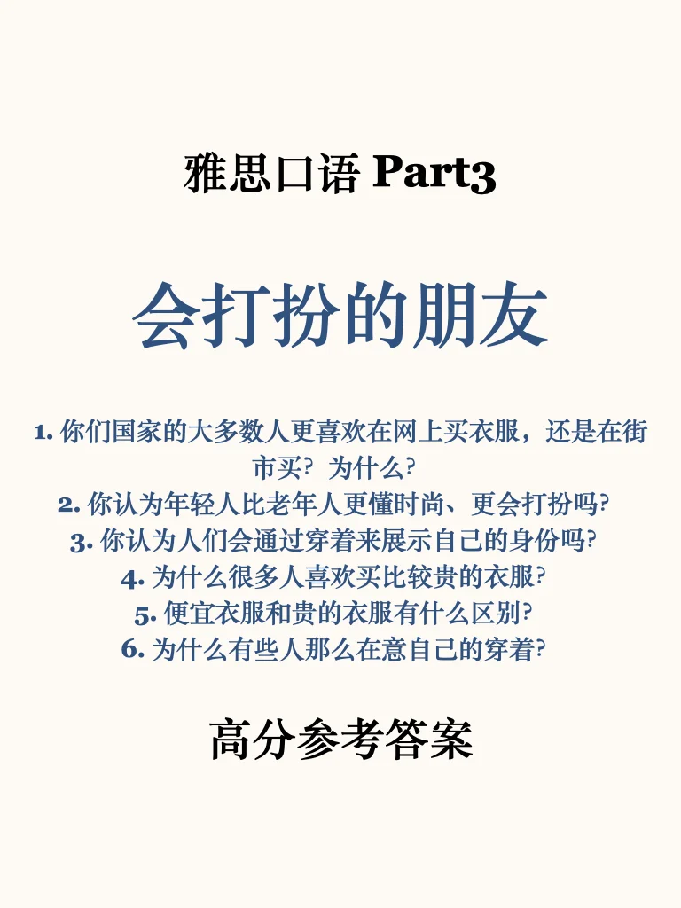
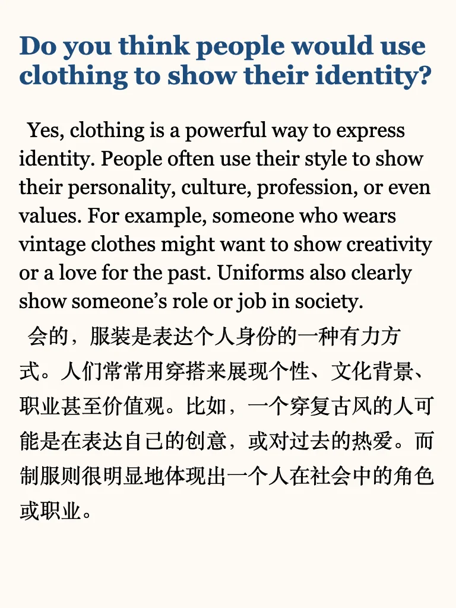

# 雅思口语part3高分参考答案

题目还在更新变动，积累一定题量再上架part3答案哦
	
短期备考，推荐我的雅思口语救急包，6个高频主题全覆盖，助你高效提分。
用行动对抗焦虑，快来练习吧💪
#雅思   #雅思自学   #雅思刷题   #英语地道表达   #雅思备考   #雅思口语   #每日英语口语学习   #雅思口语part3   #雅思攻略   #雅思口语part3高分答案

## 图片
| 图1 | 图2 | 图3 | 图4 |
| --- | --- | --- | --- |
|  |  |  |  |
|  |  |  |   |

生成时间：2025-11-14 18:30:52