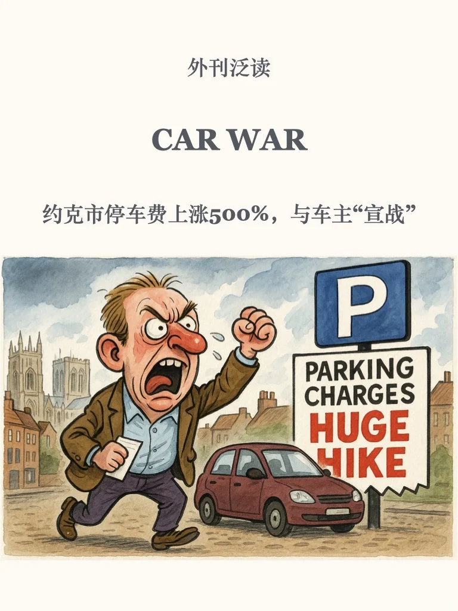
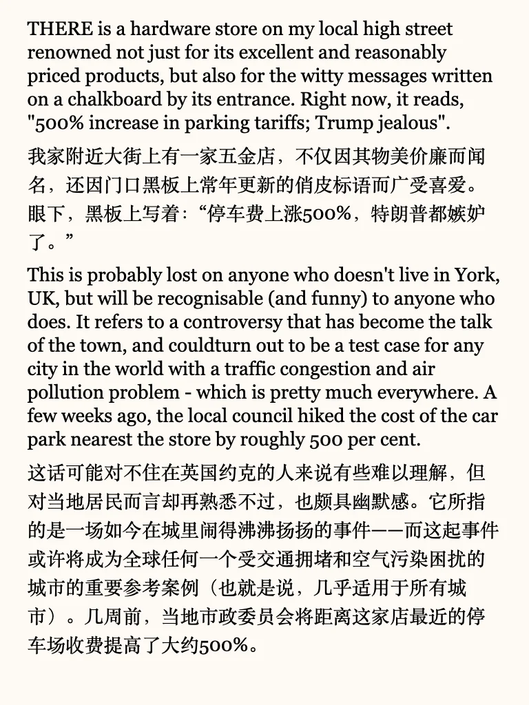
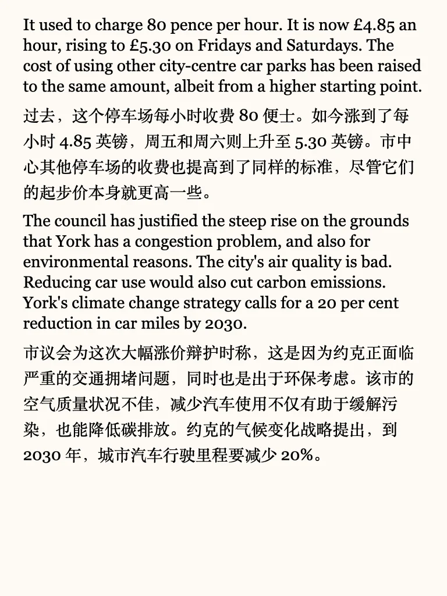
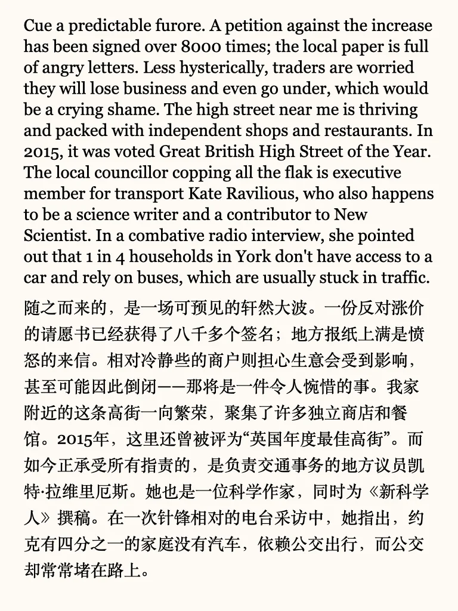
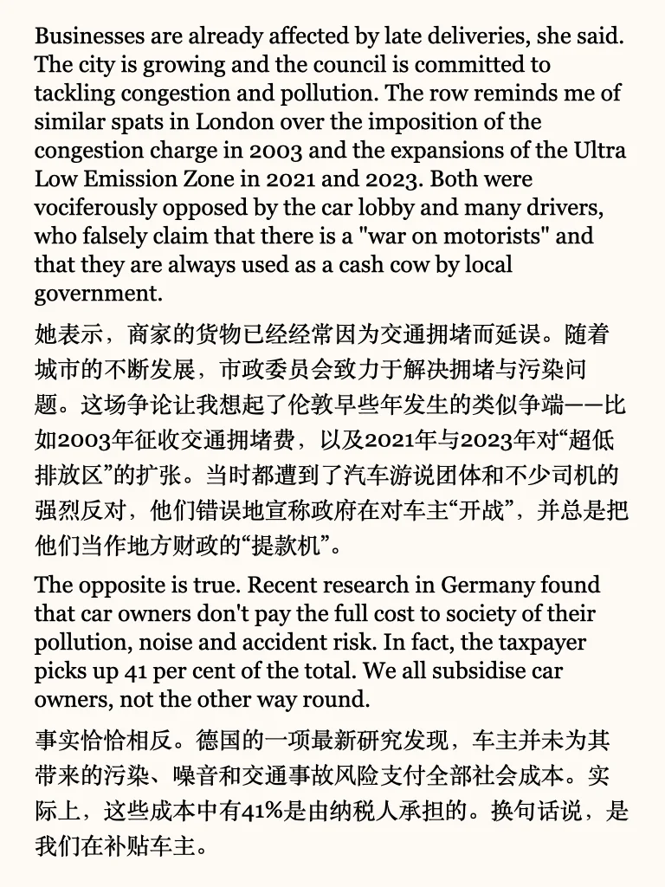
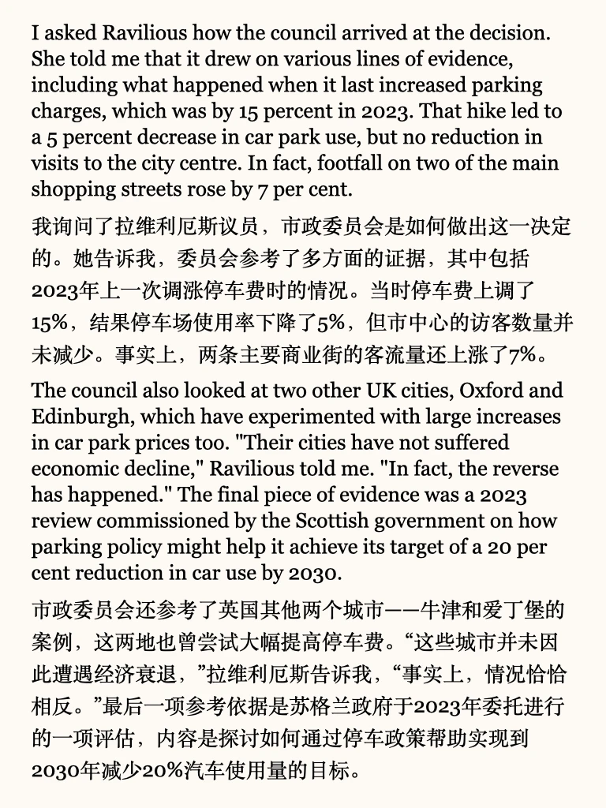
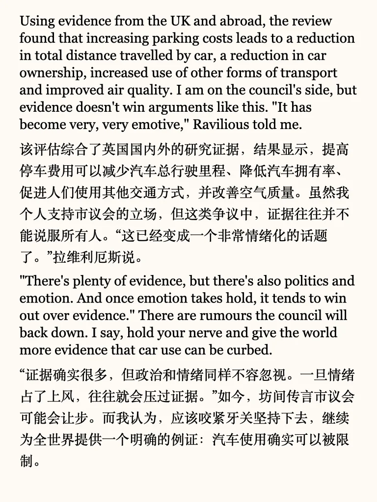

# 外刊泛读｜提高停车费是缓解堵车的好方式吗

#英语地道表达 #考研英语 #外刊 #英语阅读打卡 #英语翻译 #每日英语 #外刊打卡

## 图片
| 图1 | 图2 | 图3 | 图4 |
| --- | --- | --- | --- |
|  |  |  |  |
|  |  |  |  |
|  |   |   |   |

生成时间：2025-11-14 18:27:33