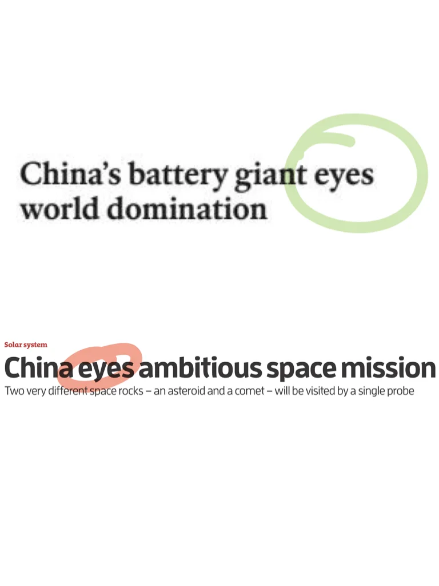
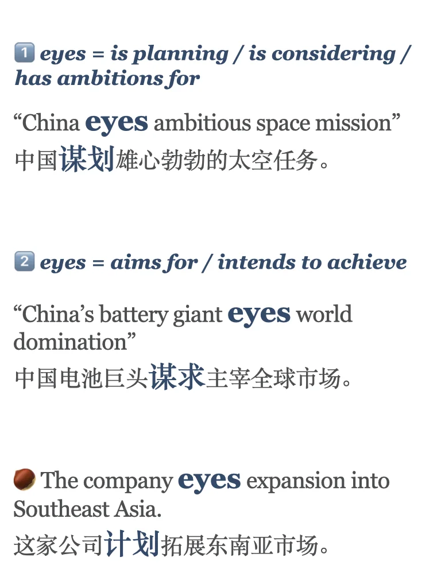
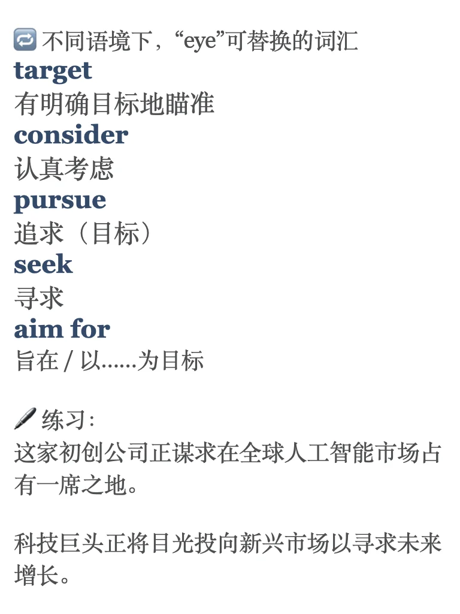

# 外刊标题在用的妙词 “eye”

eye不仅是大家都熟悉的名词，还可以是动词，表达“计划、谋求、锁定目标”等。图三有练习，在评论区里留下你的答案吧～ #英语地道表达 #考研英语 #四六级 #翻译学习 #每日英语 #外刊精读 #实用英语 #我被翻译成了 #雅思

## 图片
| 图1 | 图2 | 图3 | 图4 |
| --- | --- | --- | --- |
|  |  |  |  |

生成时间：2025-11-14 18:26:25