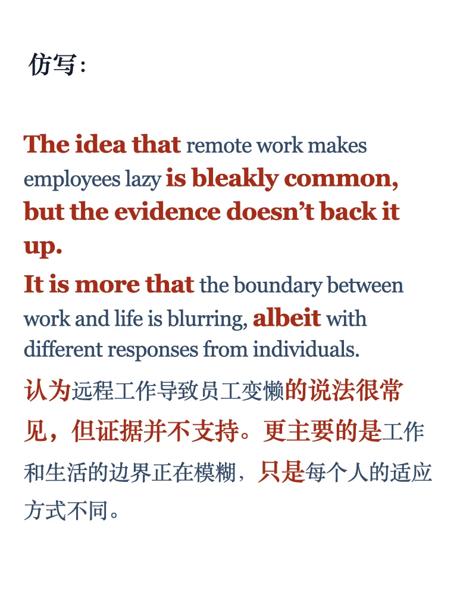
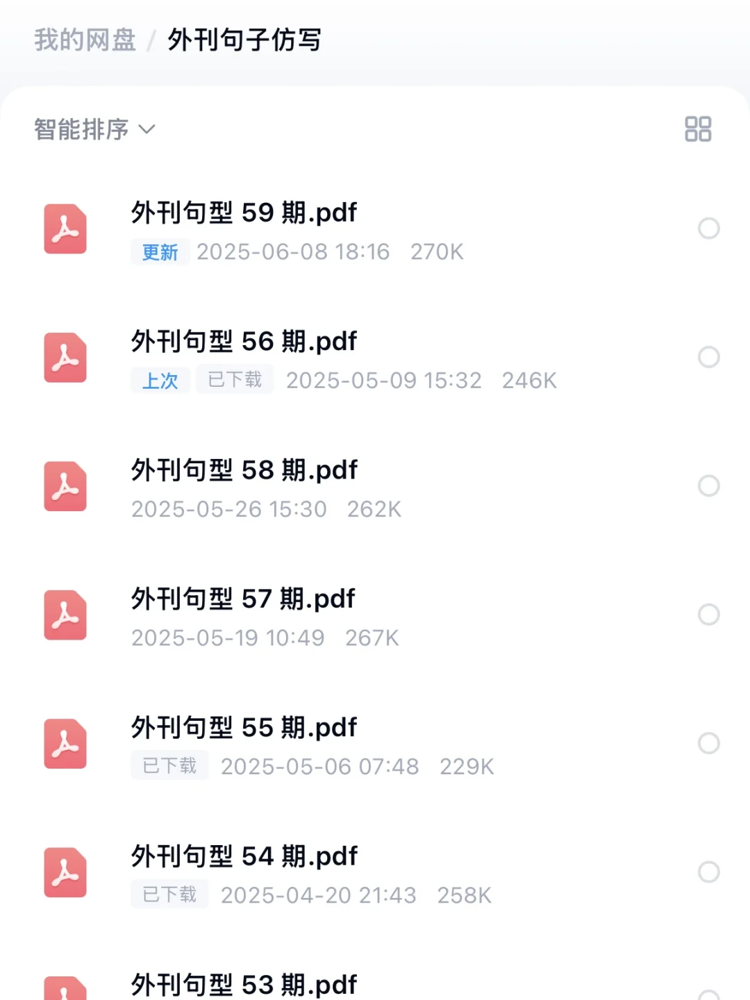

# 外刊句子仿写59期｜打破谬论

雅思、考研、四六级写作拿高分，从积累好句开始～
📖 每周精选外刊亮点句式，手把手教你仿写，帮你提升表达，写出地道语感！
📚 已更新至第59期，点击左下角获取完整PDF，持续更新中。
#英语写作 #四六级写作 #考研英语 #雅思写作 #英语高分表达 #外刊金句 #英语地道表达 #写作素材 #英语作文 #学术写作
平时分享的内容受篇幅限制，很多是段落节选或者词汇讲解，我把平时阅读的文章从期刊、网页中筛选出来，以PDF格式保存。想更阅读更完整的外刊原文，欢迎加入群聊🎉
	
更多干货内容，丰富外刊资源，见最后一页🌹

## 图片
| 图1 | 图2 | 图3 | 图4 |
| --- | --- | --- | --- |
|  |  |  |  |
|  |  |  |   |

生成时间：2025-11-14 15:43:55