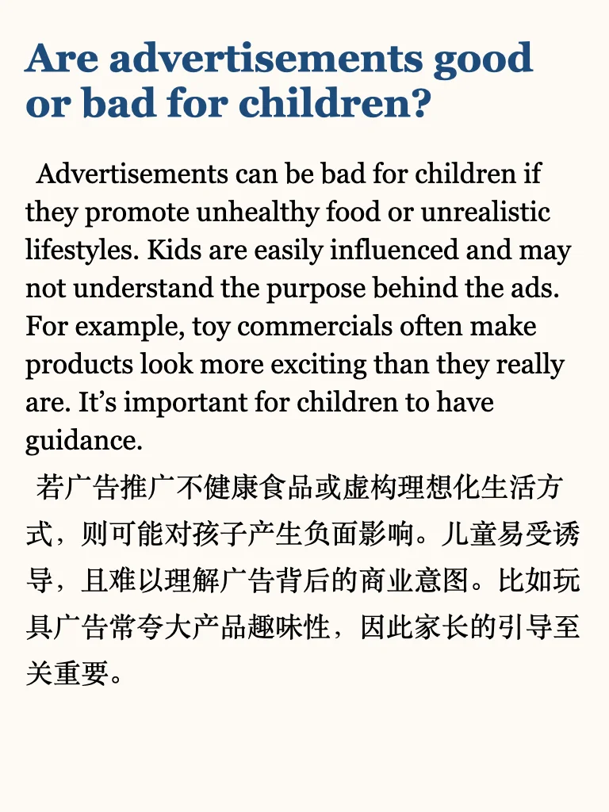
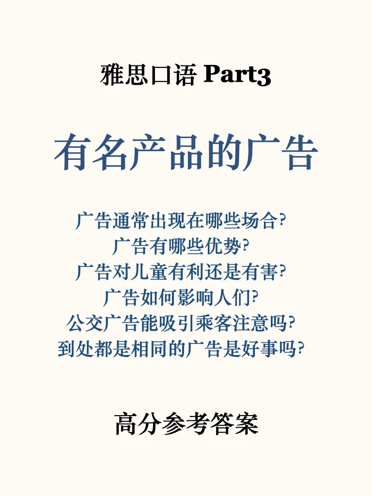
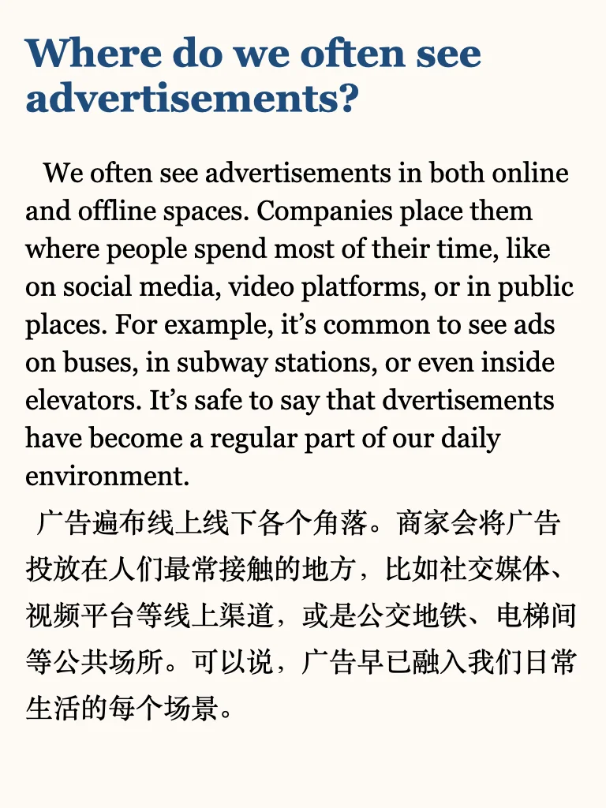
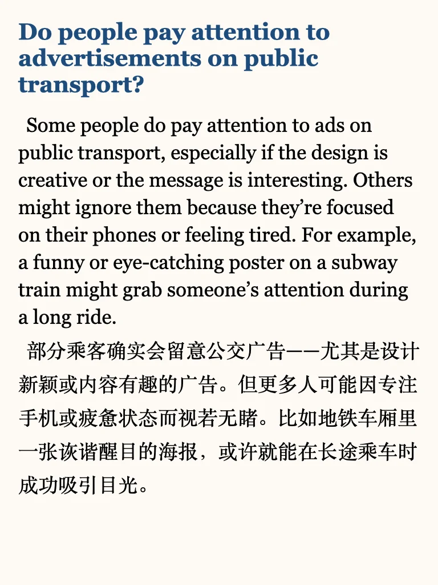

# 雅思口语part3高分参考答案

新题量比较大part3答案还在写✍️
近期考试的同学推荐学习救急包，六个主题看透题库💪
#雅思 #英语地道表达 #雅思口语 #雅思口语part3 #雅思口语part3高分答案 #雅思备考 #雅思考试 #口语

## 图片
| 图1 | 图2 | 图3 | 图4 |
| --- | --- | --- | --- |
|  |  |  |  |
|  |  |  |   |

生成时间：2025-11-14 18:22:00