# 雅思口语part3高分参考答案

更新啦 约340道题，中英对照，约5万字。
答案难度、风格可以参考平时笔记分享的题目～
赠送往期两季度题库和学习资料，最后一图🌹

## 图片
| 图1 | 图2 | 图3 | 图4 |
| --- | --- | --- | --- |
| 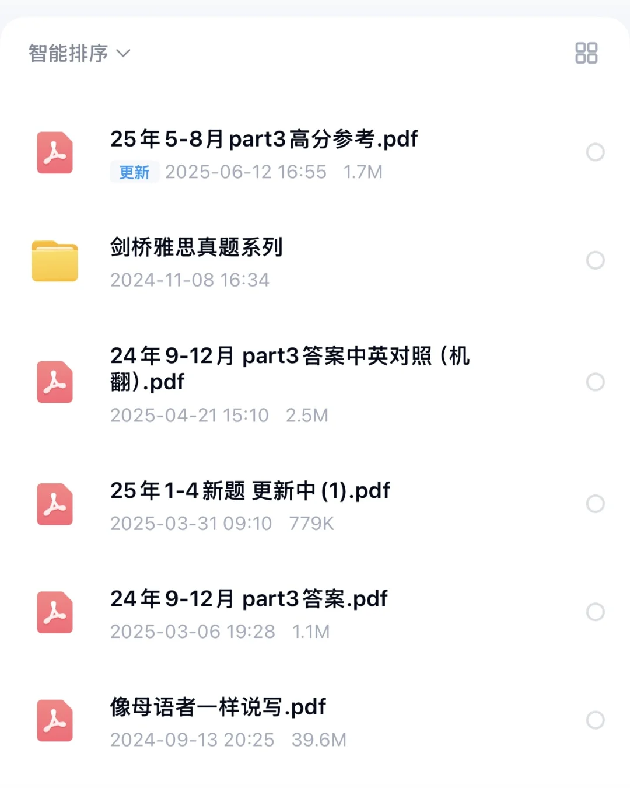 | 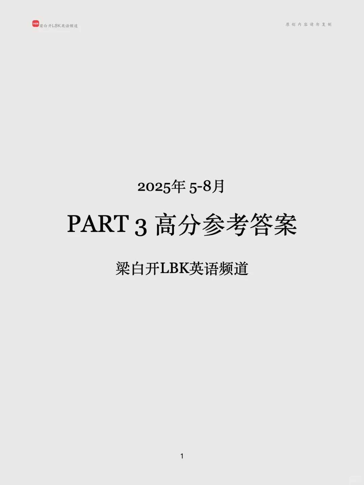 | 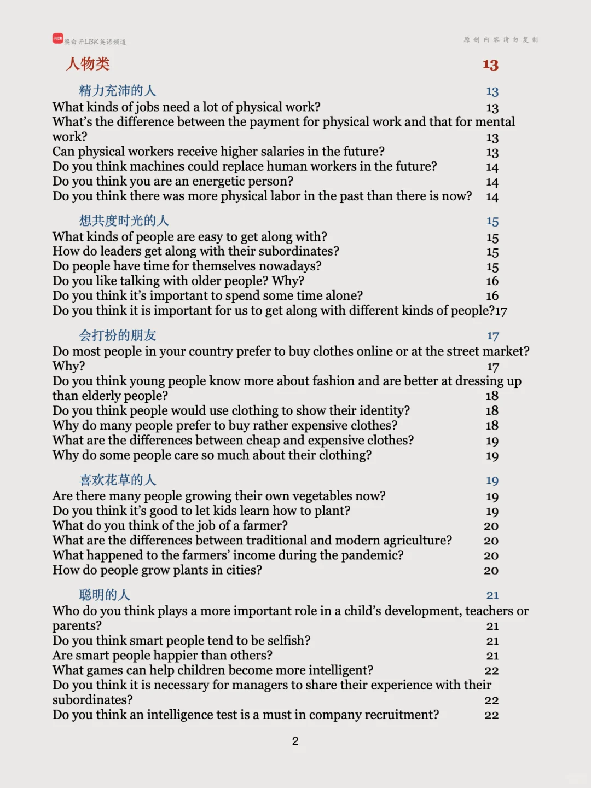 | 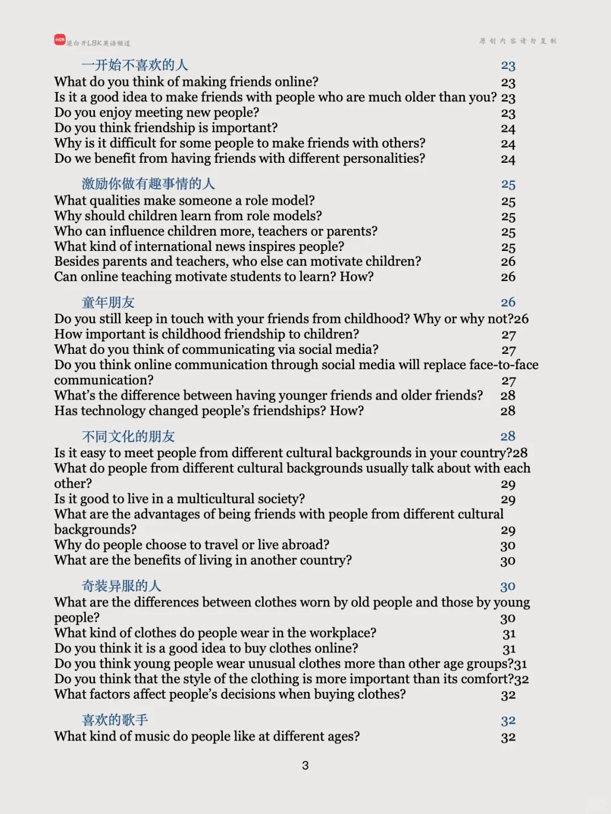 |
| 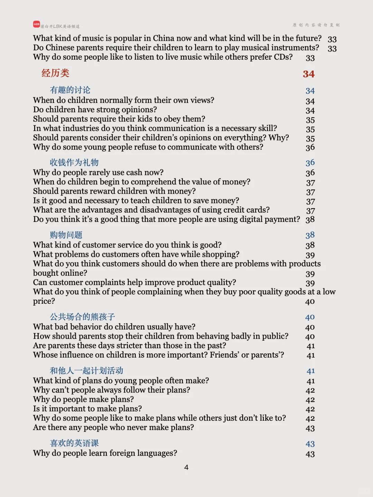 | 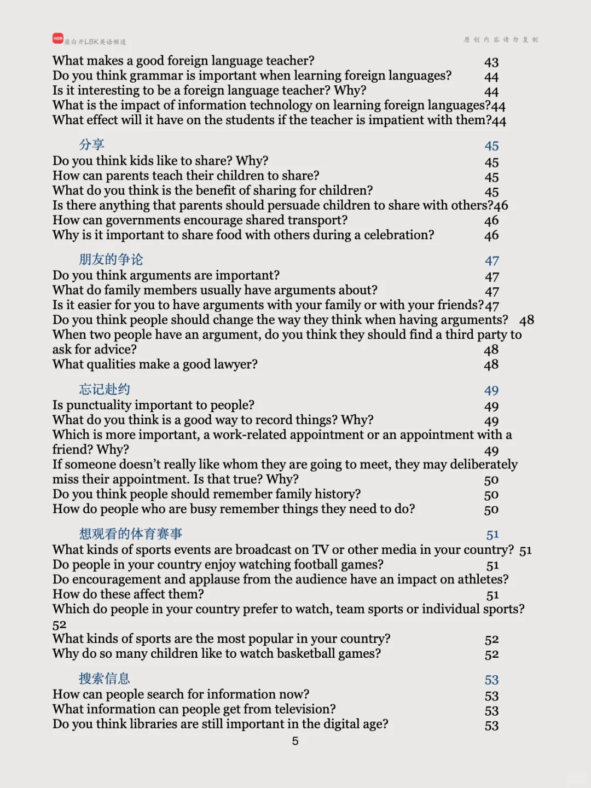 | 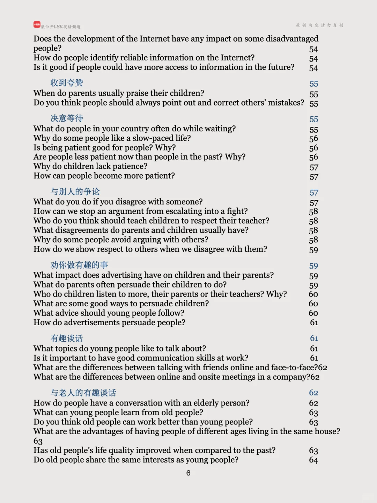 | 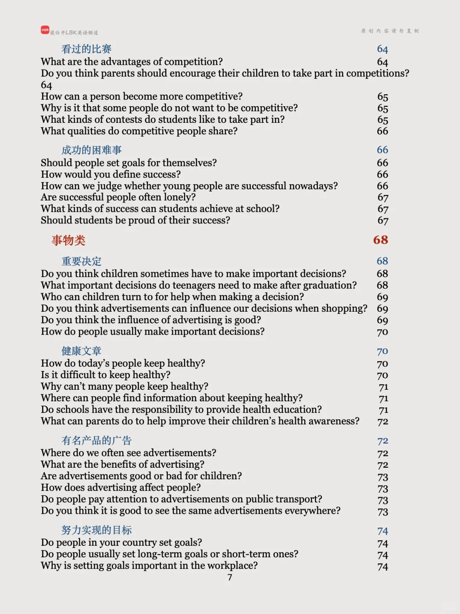 |
| 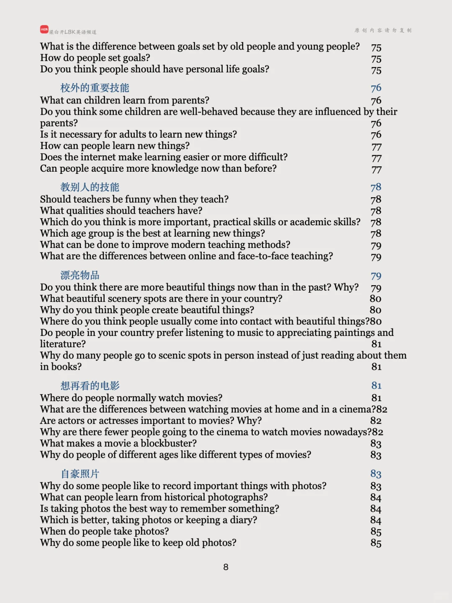 | 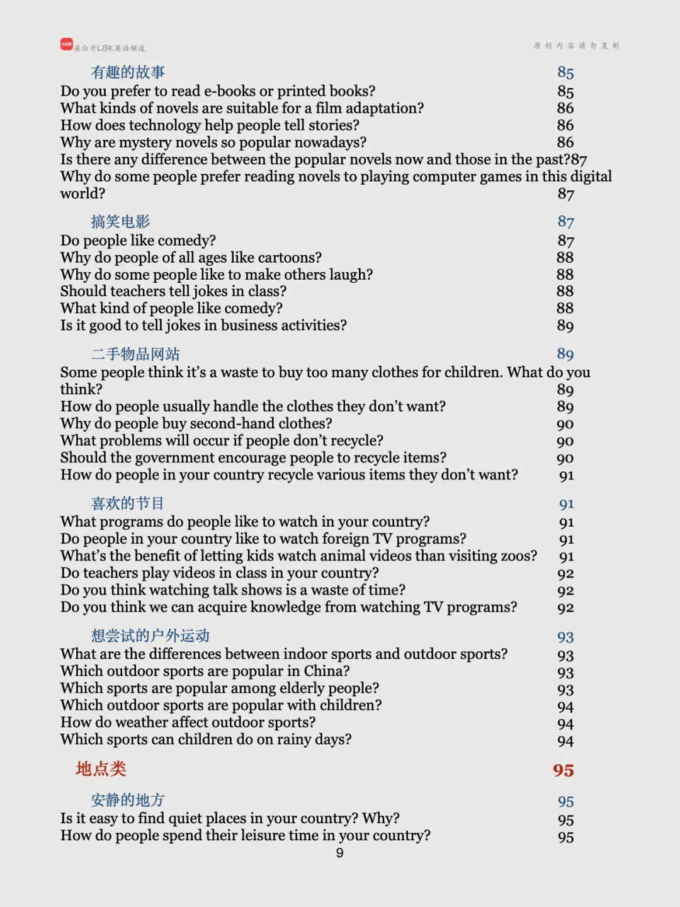 | 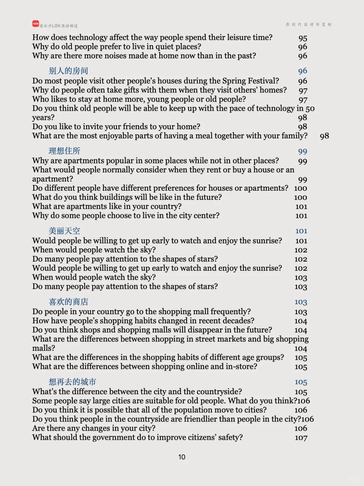 | 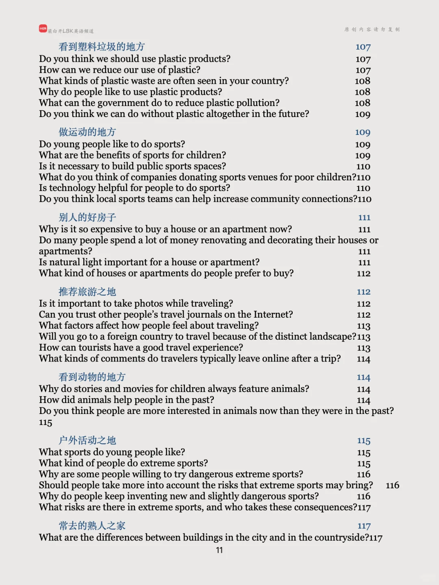 |
| 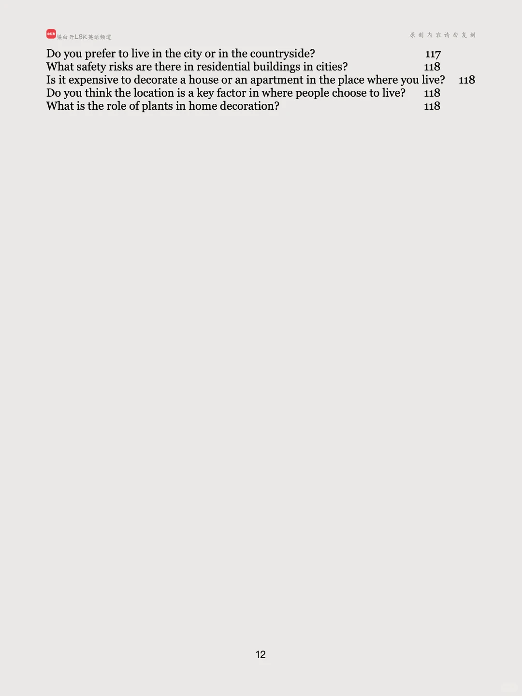 |   |   |   |

生成时间：2025-11-14 18:18:42