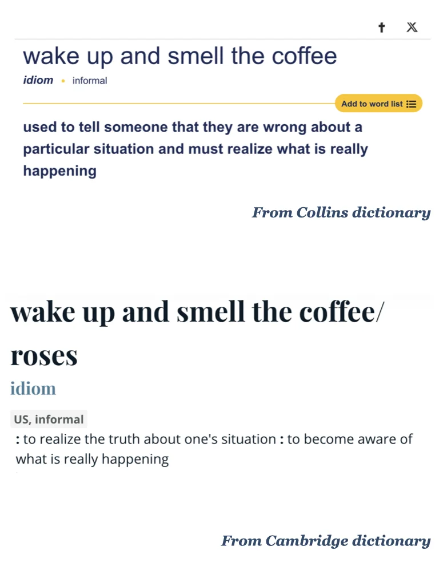

# 积累一个外刊中的地道表达~

#英语地道表达 #四六级 #考研英语 #英语俚语 #每日一词 #翻译学习 #英文学习 #外刊精读 #英语写作
	
平时分享的内容受篇幅限制，很多是段落节选或者词汇讲解
我把平时阅读的文章从期刊、网页中筛选出来，以PDF格式保存
想更阅读更完整的外刊原文，欢迎加入群聊🎉

## 图片
| 图1 | 图2 | 图3 | 图4 |
| --- | --- | --- | --- |
|  |  |  |   |

生成时间：2025-11-13 20:59:57