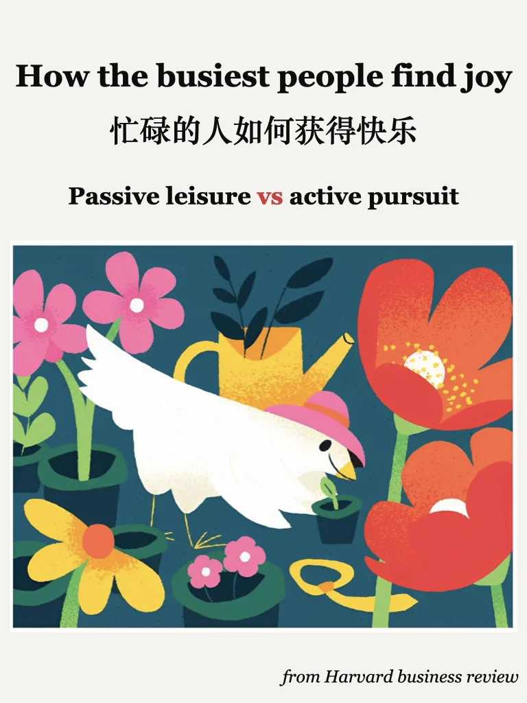
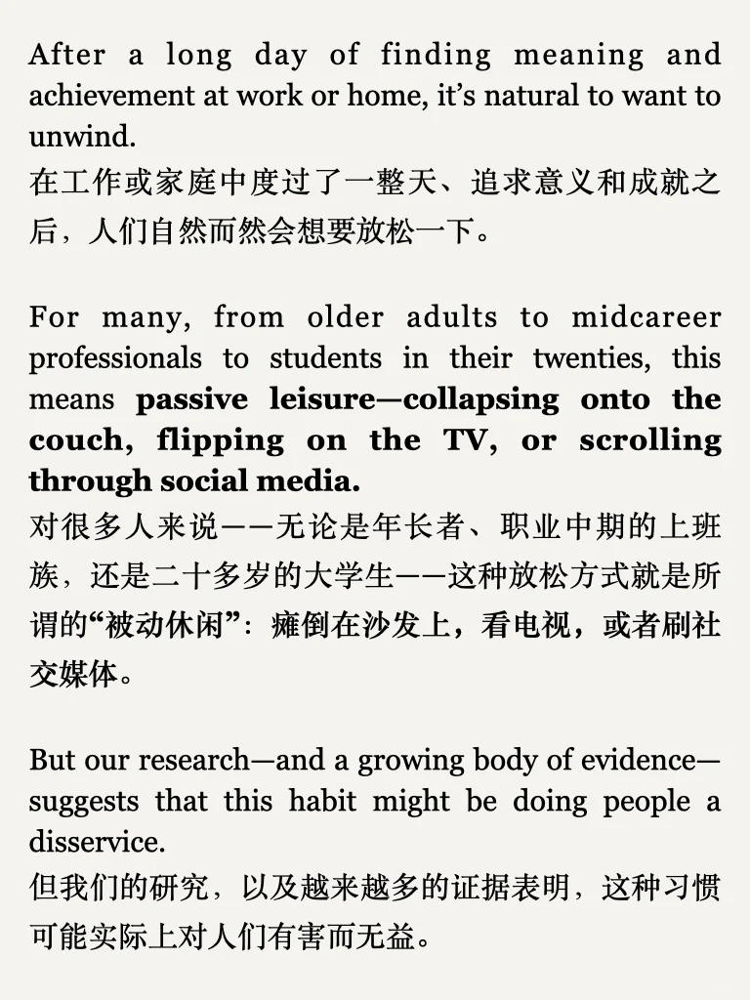
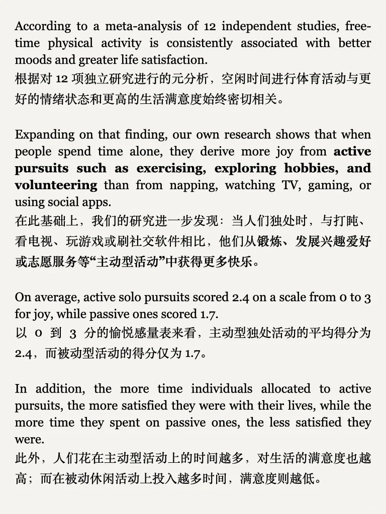

# “被动”与“主动”的休闲方式，效果大不相同

#外刊 #英语泛读 #英语地道表达 #轻松自在的生活 #顺应自然节奏 #休息 #快乐
	
更多干货内容，丰富外刊资源，见最后一页🌹
平时分享的内容受篇幅限制，很多是段落节选或者词汇讲解，我把平时阅读的文章从期刊、网页中筛选出来，以PDF格式保存，想更阅读更完整的外刊原文，欢迎加入群聊🎉

## 图片
| 图1 | 图2 | 图3 | 图4 |
| --- | --- | --- | --- |
|  |  |  |  |
|  |   |   |   |

生成时间：2025-11-13 20:56:17