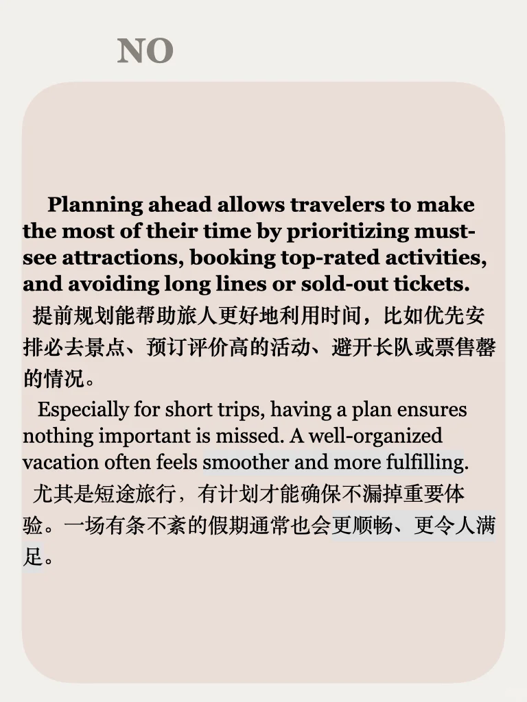

# 思辨82期｜假期该严格计划还是说走就走？

📖 每周一个热点话题，涵盖社会、科技、媒体等，从正反两面深入分析，助你积累写作素材，提升口语表达！
📚 已更新至第82期，👇获取完整PDF，持续更新中。
#雅思写作 #雅思口语 #辩证思维 #考研英语 #四六级 #深度思考 #思辨训练 #逻辑表达 #学术写作 #口语高分

## 图片
| 图1 | 图2 | 图3 | 图4 |
| --- | --- | --- | --- |
|  |  |  |  |
|  |  |  |   |

生成时间：2025-11-13 20:45:30