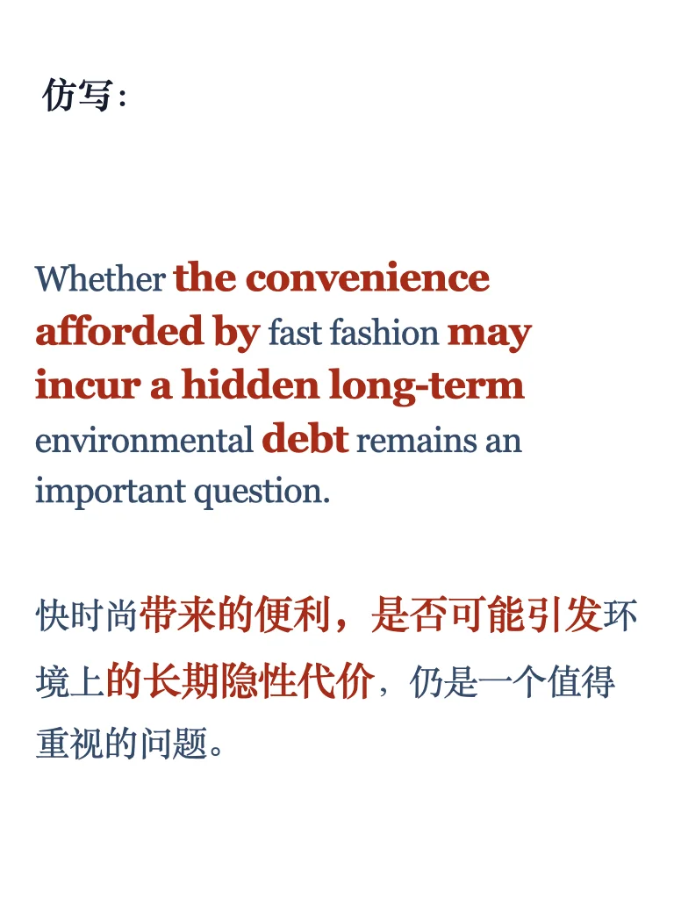

# 外刊句子仿写66期｜快速发展的隐性代价

📖 每周精选外刊亮点句式，手把手教你仿写，帮你提升表达，写出地道语感！
📚 已更新至第66期，⬇️获取完整PDF，持续更新中。
#英语写作 #四六级写作 #考研英语 #雅思写作 #英语高分表达 #外刊金句 #英语地道表达 #写作素材 #英语作文 #学术写作

## 图片
| 图1 | 图2 | 图3 | 图4 |
| --- | --- | --- | --- |
|  |  |  |  |
|  |   |   |   |

生成时间：2025-11-13 20:34:20