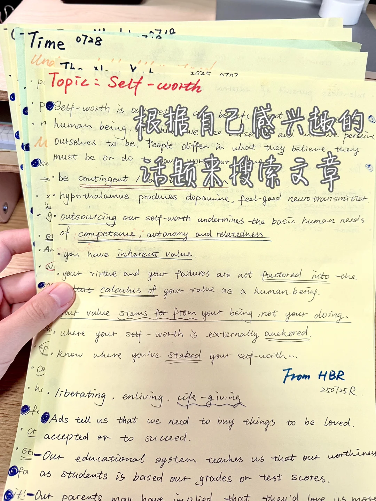
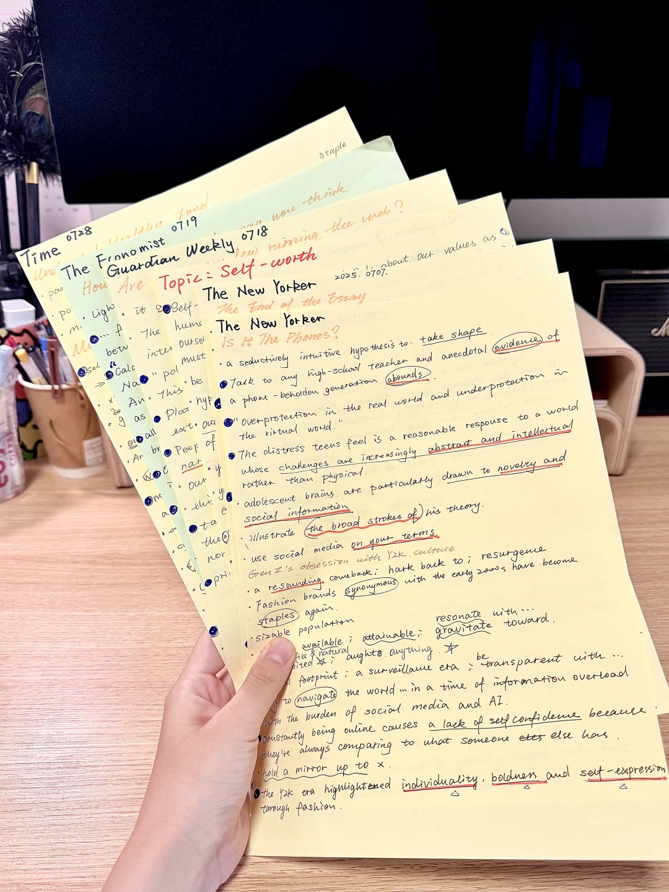
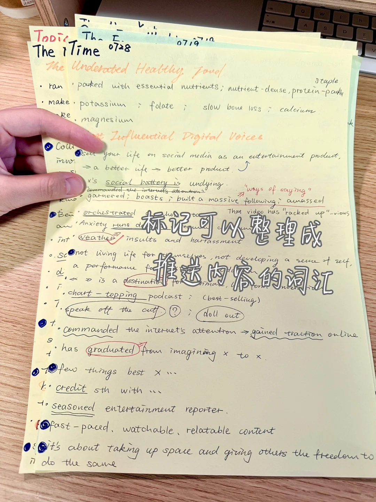
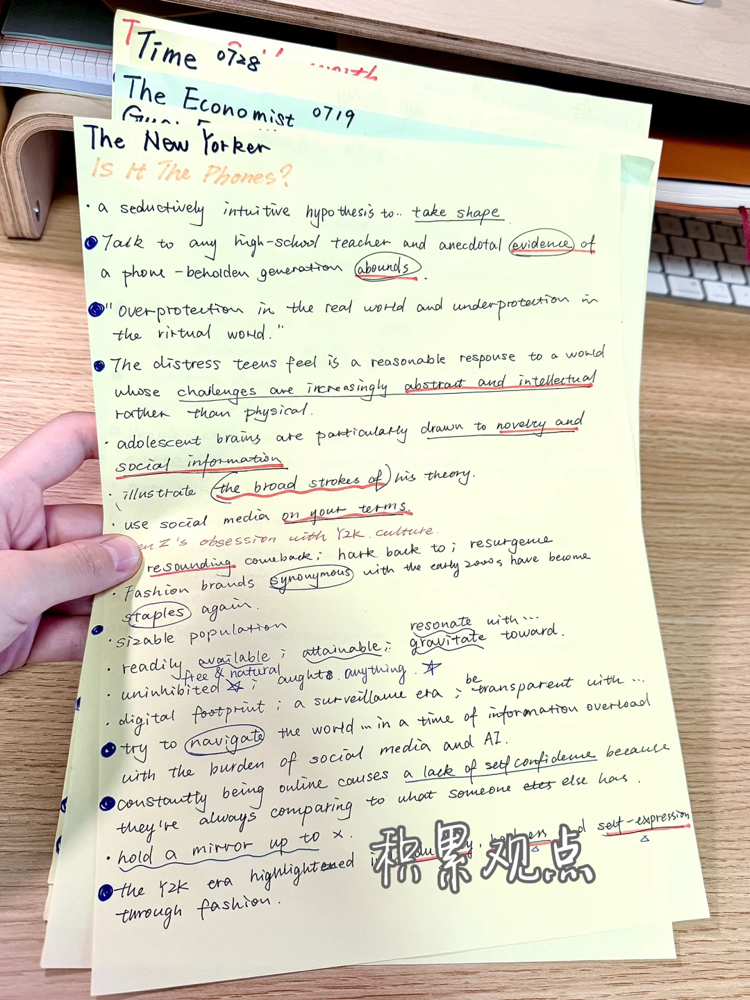

# 七月的纸质外刊笔记

漂亮本子也不少，但做笔记还是A4纸更顺手
阅读的时候会在pad上标画，隔几天整理一次纸质笔记，梳理文章里的有趣观点和地道表达，有时也会发现很多值得分享的内容，标记下来后期整理成推送笔记。
	
#外刊精读 #英语笔记 #笔记 #英文阅读 #笔记 #英语阅读打卡

## 图片
| 图1 | 图2 | 图3 | 图4 |
| --- | --- | --- | --- |
|  |  |  |  |

生成时间：2025-11-13 20:39:56