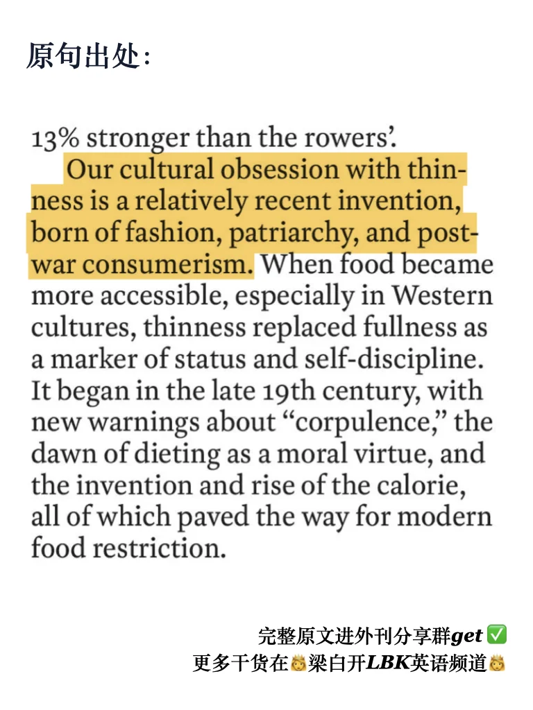
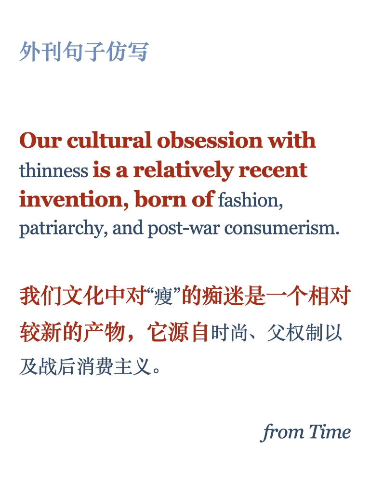
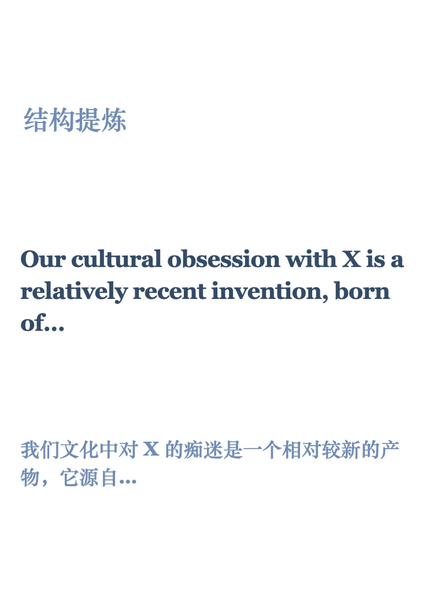
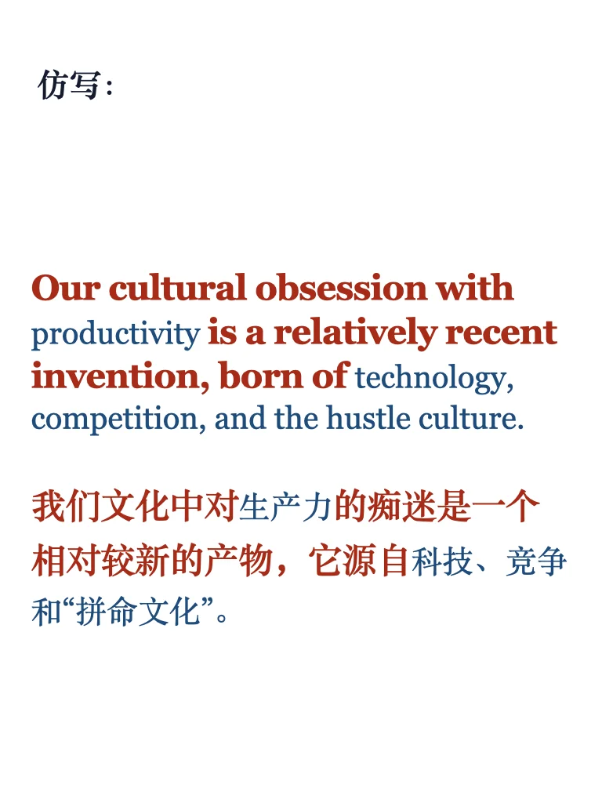
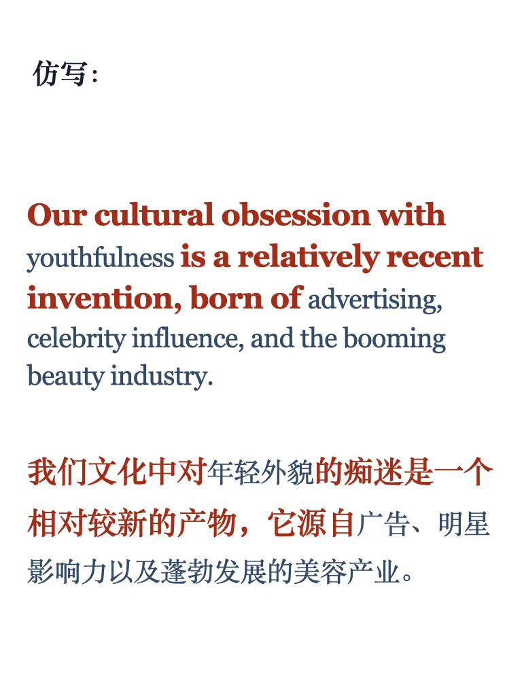

# 外刊句子仿写69期｜“瘦文化”是现代新产物

原句来自时代周刊文章 women are meant to be strong
可以模仿结构来写新趋势的原因，或进行批判
原文可进群get
更多外刊金句、仿写练习持续更新中⬇️
#英语地道表达 #考研英语 #四六级 #翻译学习 #外刊精读 #学术写作 #仿写 #强壮女人 #时代周刊

## 图片
| 图1 | 图2 | 图3 | 图4 |
| --- | --- | --- | --- |
|  |  |  |  |
|  |   |   |   |

生成时间：2025-11-13 20:20:45