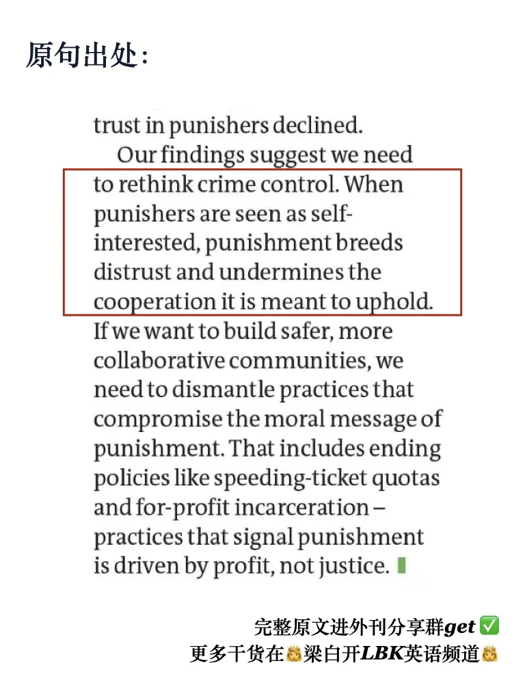
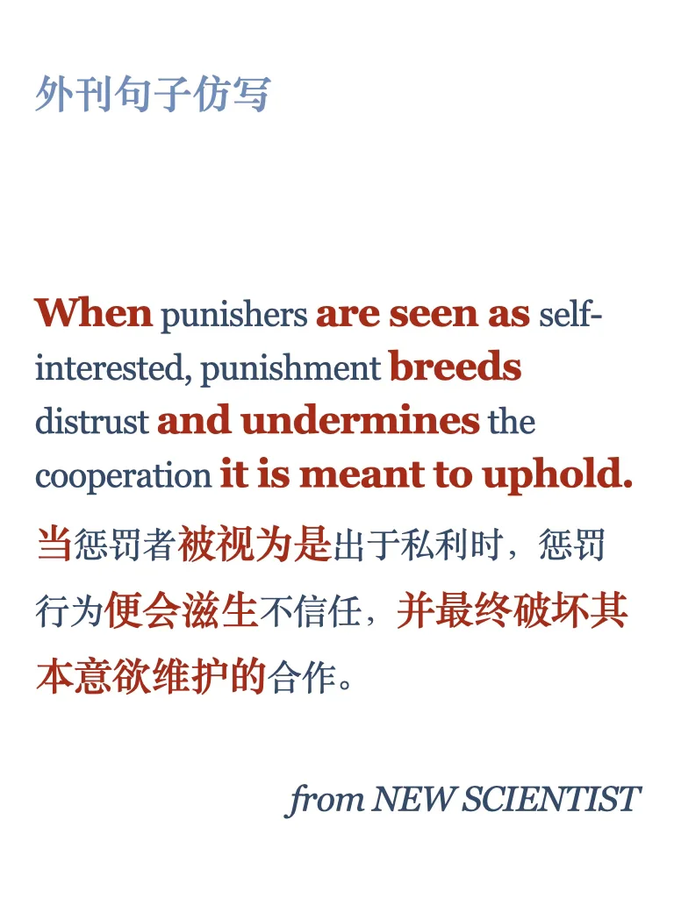
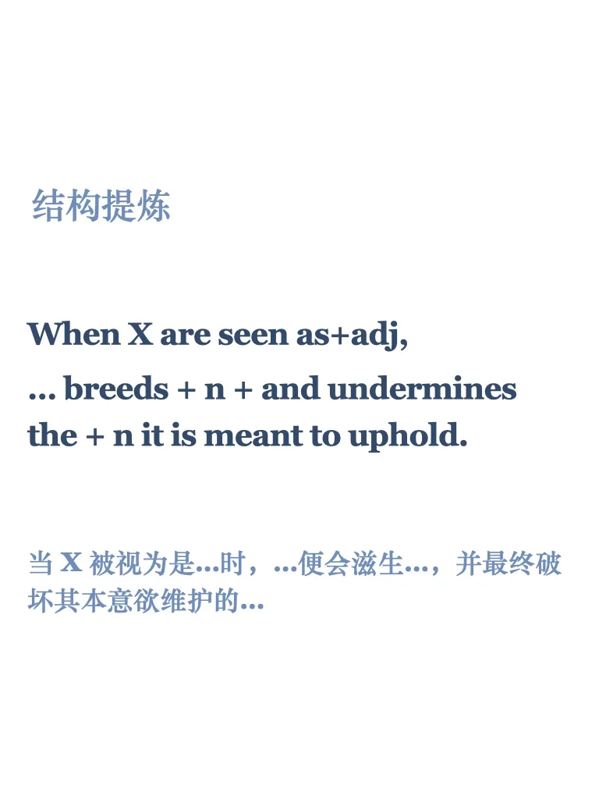
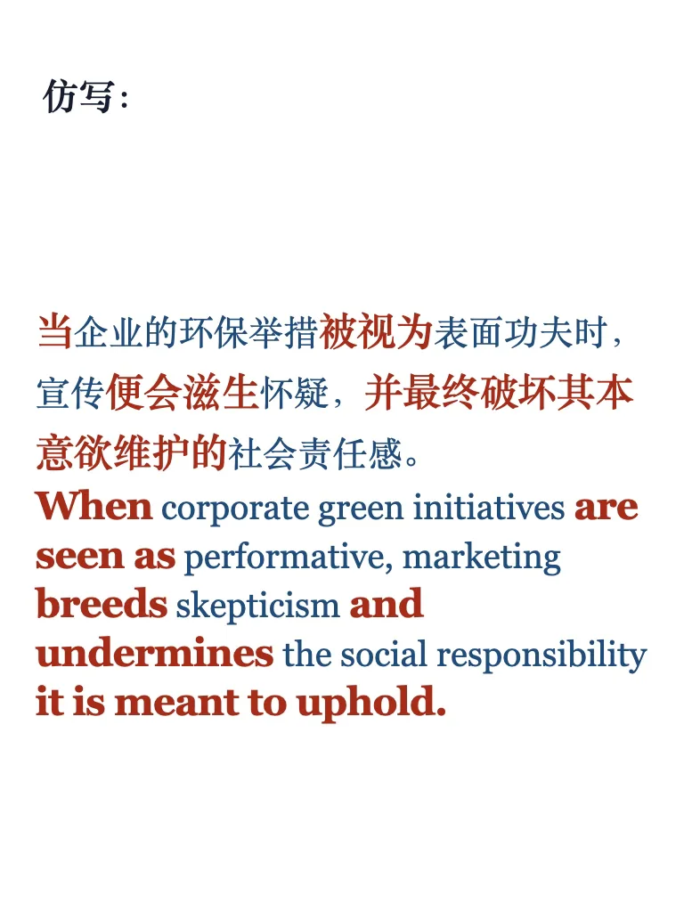

# 外刊句子仿写78期｜“事与愿违”

惩罚错误行为的目的是保护合作，但当惩罚者目的不单纯时，人们会失去对权威的信任，这样惩罚便破坏了合作，形成“事与愿违”的悖论。
你还能想到那些类似情况？来造句练习试试吧～
	
📖 每周精选外刊亮点句式，手把手教你仿写，帮你提升表达，写出地道语感！
📚 已更新至第78期，点击左下角获取完整PDF，持续更新中。
	
#英语写作 #四六级写作 #考研英语 #雅思写作 #英语高分表达 #外刊金句 #英语地道表达 #写作素材 #英语作文 #学术写作

## 图片
| 图1 | 图2 | 图3 | 图4 |
| --- | --- | --- | --- |
|  |  |  |  |
|  |   |   |   |

生成时间：2025-11-12 17:20:11