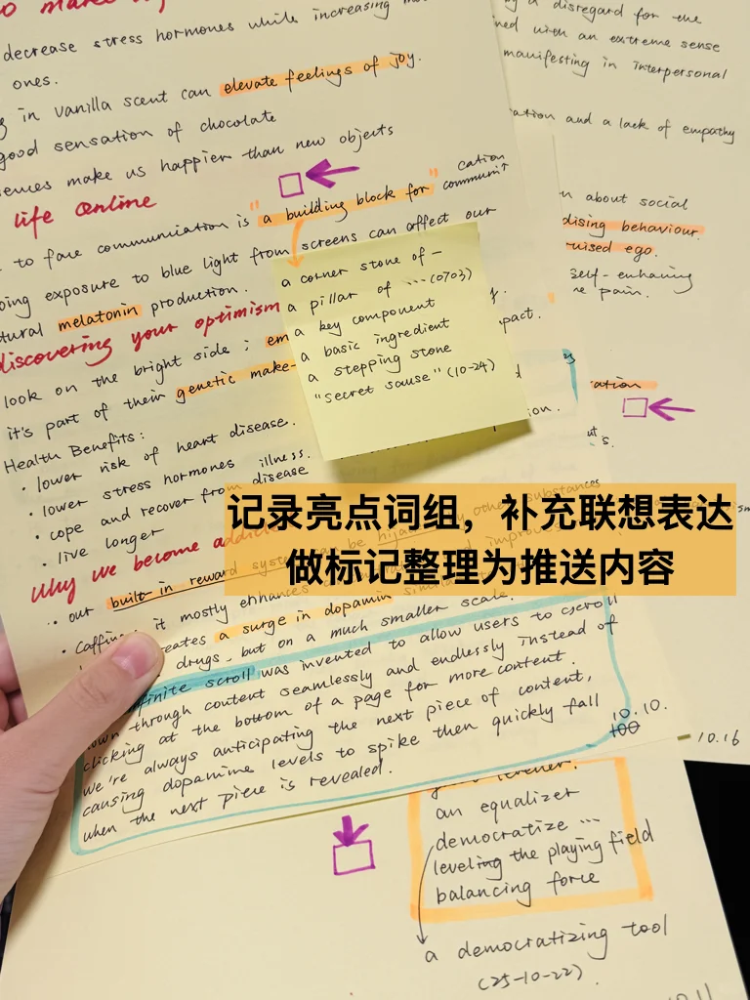
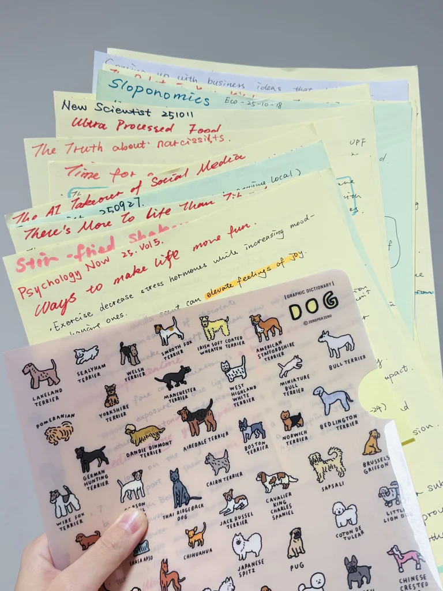
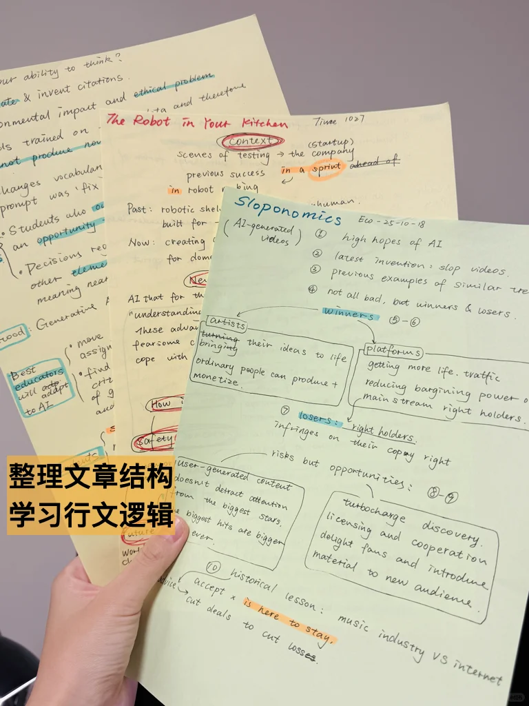
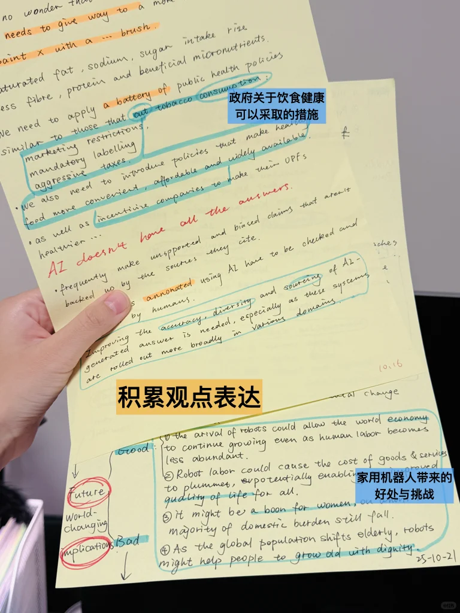

# 十月的外刊纸质笔记

加入了对文章结构和词组的更多思考总结，继续保持反思整理，争取归纳整合方面做得更好一些。
#英语地道表达 #考研英语 #英语阅读打卡 #英文学习 #外刊 #外刊精读打卡 #外刊精读

## 图片
| 图1 | 图2 | 图3 | 图4 |
| --- | --- | --- | --- |
|  |  |  |  |

生成时间：2025-11-12 17:11:41